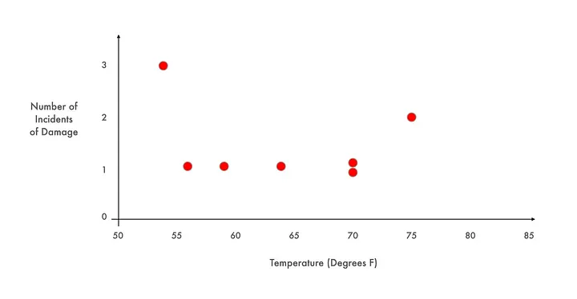

Kasus **Carter Racing** adalah salah satu studi kasus paling klasik dan brilian di sekolah bisnis (Harvard/Stanford) yang sering digunakan untuk mengajarkan pengambilan keputusan dan evaluasi risiko.

## Studi Kasus: "Keputusan Go/No-Go Tim Balap Carter"

### 1. Latar Belakang (The Context)

BJ Carter dan timnya sedang bersiap untuk balapan terakhir musim ini di Sirkuit Pocono. Ini adalah momen hidup dan mati bagi bisnis mereka:

- **Insentif Finansial:** Jika mereka finis di 5 besar, mereka akan mendapatkan sponsor musiman senilai $2 juta. Ini cukup untuk menyelamatkan tim dari kebangkrutan.
    
- **Kondisi Saat Ini:** Kas perusahaan menipis. Jika mereka tidak balapan (atau gagal finis), sponsor akan mundur, dan Carter Racing kemungkinan besar akan gulung tikar.
    
- **Biaya Partisipasi:** Mengikuti balapan membutuhkan biaya operasional (ban, bahan bakar, kru) yang memakan sisa uang tunai terakhir mereka.
    

### 2. Identifikasi Masalah (Risk Identification)

Mesin mobil balap Carter mengalami masalah pada _gasket head_ (paking kepala silinder). Dalam 24 balapan terakhir, mereka mengalami 7 kali kegagalan mesin (mesin meledak/mati).

### 3. Analisis Data (Risk Analysis Input)

Malam sebelum balapan, mekanik utama (Robin) dan ahli mesin (Pat) berdebat sengit.

- **Ramalan Cuaca:** Suhu saat balapan besok diperkirakan **4°C/39°F (sangat dingin)**.
    
- **Pendapat Robin (Risk Averse):** "Setiap kali udara dingin, mesin kita bermasalah. Kita tidak boleh balapan besok. Karet gasket menyusut saat dingin dan tidak bisa menahan tekanan turbo."
    
- **Pendapat Pat (Risk Taker/Data Driven?):** "Data tidak mendukung itu. Lihat grafik 7 kegagalan kita. Ada yang gagal di suhu dingin, ada juga yang gagal di suhu hangat. Tidak ada korelasi jelas. Masalahnya mungkin cuma nasib buruk atau cara menyetir."
    

### 4. Dilema Evaluasi (The Evaluation)

Sekarang pukul 10 malam. BJ Carter harus memutuskan: **Balapan (Go) atau Mundur (No-Go)?**

- **Skenario A (Balapan & Berhasil):** Selamat dari kebangkrutan, sukses besar.
    
- **Skenario B (Balapan & Gagal Mesin):** Kehilangan biaya operasional, malu di TV nasional, kehilangan sponsor, bangkrut. Ditambah risiko keselamatan pembalap (kecelakaan akibat oli tumpah).
    
- **Skenario C (Tidak Balapan):** Pasti kehilangan sponsor, kemungkinan besar bangkrut, tapi mesin selamat dan pengemudi aman.
    