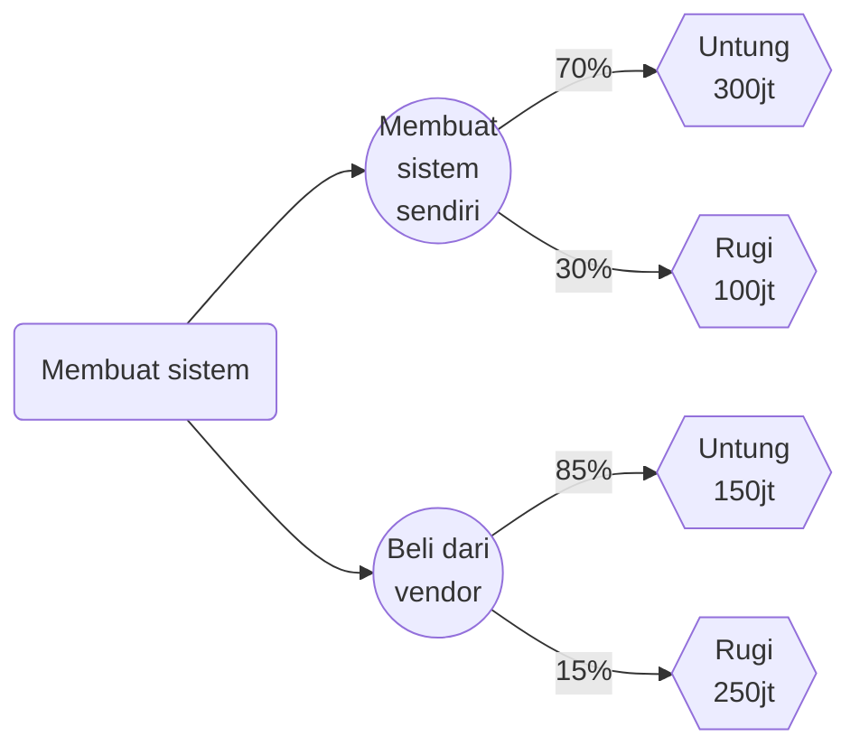
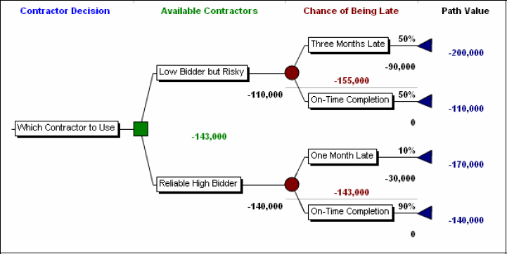
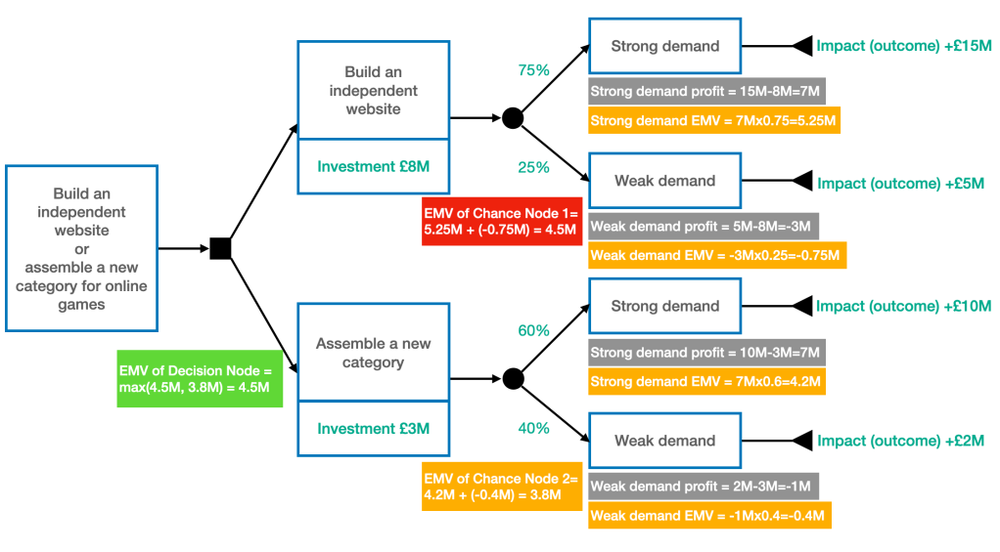
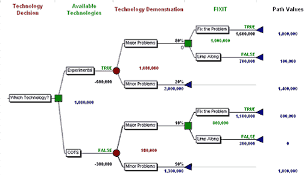
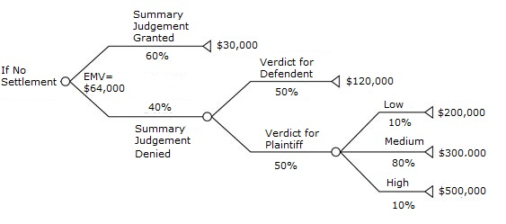
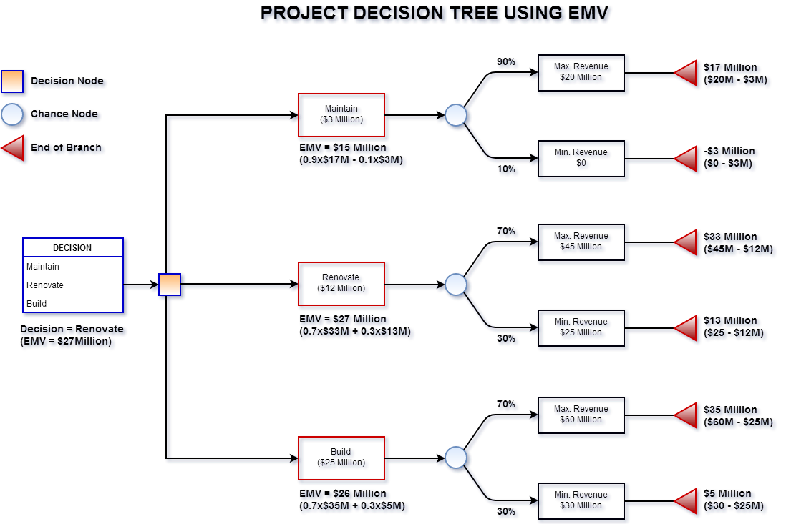

# Metode Analisis Risiko Kuantitatif

## 1. Pendahuluan

Jika pada analisis **kualitatif** risiko dinilai dengan deskripsi (low, medium, high), maka pada **analisis kuantitatif** risiko dinilai menggunakan **angka, data statistik, dan model matematis**.  
Metode ini biasanya digunakan pada proyek besar, industri keuangan, kesehatan, energi, atau teknologi yang membutuhkan **akurasi tinggi** dalam pengukuran risiko.

---

## 2. Tujuan Analisis Kuantitatif

1. Mengukur risiko secara **numerik** untuk memperkirakan besarnya kerugian.
    
2. Membandingkan alternatif strategi pengendalian risiko berdasarkan **nilai finansial**.
    
3. Menyediakan dasar kuat untuk **pengambilan keputusan investasi** dan **alokasi sumber daya**.
    
4. Menghitung **eksposur risiko total** organisasi/proyek.
    

---

## 3. Input Data yang Dibutuhkan

1. **Data Historis** → frekuensi kejadian, kerugian sebelumnya.
    
2. **Distribusi Probabilitas** → kemungkinan terjadinya risiko.
    
3. **Nilai Kerugian Potensial** → kerugian finansial atau non-finansial.
    
4. **Model Matematis / Simulasi** → untuk menghitung perkiraan dampak total.
    

---

## 4. Metode Analisis Kuantitatif

### 4.1. Expected Monetary Value (EMV)

**Expected Monetary Value (EMV)** atau **Nilai Harapan Moneter** adalah salah satu teknik kuantitatif yang digunakan dalam **analisis risiko** untuk mengukur **dampak finansial rata-rata** dari suatu keputusan atau kejadian yang memiliki **ketidakpastian**.

Expected Monetary Value adalah **nilai rata-rata tertimbang** dari semua kemungkinan hasil (baik positif maupun negatif), dengan masing-masing hasil dikalikan oleh **probabilitas terjadinya**.

Secara matematis:  
$$\text{EMV} = \sum (P_i \times V_i)$$

di mana:

- $P_i$ = probabilitas terjadinya hasil ke-i
    
- $V_i$ = nilai moneter (dampak finansial) dari hasil ke-i
    

---

#### Tujuan Penggunaan EMV

1. **Membantu pengambilan keputusan berbasis data**, bukan hanya intuisi.
    
2. **Membandingkan beberapa alternatif keputusan** untuk memilih yang memberikan nilai ekspektasi terbaik.
    
3. **Menilai besarnya risiko finansial** dari suatu proyek atau kejadian.
    
4. Digunakan dalam **analisis keputusan (decision tree)** dan **analisis risiko proyek** seperti di manajemen proyek, investasi, maupun asuransi.
    

---

#### Contoh Perhitungan EMV

Misalkan dalam proyek pengembangan sistem:

- Ada risiko **keterlambatan proyek** dengan probabilitas 30% (0.3).
    
- Jika terjadi, kerugian finansial diperkirakan sebesar **Rp 100 juta**.
    
- Jika tidak terjadi (probabilitas 70% atau 0.7), tidak ada kerugian (Rp 0).
    

Maka:

$$EMV = (0.3 \times -100.000.000) + (0.7 \times 0) = -30.000.000$$

👉 **Interpretasi:**  
Nilai EMV sebesar **–Rp 30 juta** menunjukkan bahwa secara rata-rata, risiko keterlambatan ini akan menyebabkan **kerugian ekspektasi Rp 30 juta** terhadap proyek.

---

#### Kelebihan dan Keterbatasan EMV

**Kelebihan:**

- Memberikan **dasar kuantitatif** untuk pengambilan keputusan.
    
- Mudah digunakan dalam **model probabilistik dan decision tree**.
    

**Keterbatasan:**

- Bergantung pada **akurasi estimasi probabilitas dan dampak**.
    
- Tidak mempertimbangkan **faktor non-finansial** (seperti reputasi, moral tim, dll).
    
- Tidak menggambarkan **variabilitas risiko ekstrem (outlier)**.

#### Contoh Kasus

1. [Kasus Risiko Kelebihan Biaya Proyek (Ancaman/Threat)](artikel/contoh-emv-1.md)
2. [Kasus Peluang Mendapatkan Kontrak Baru (Peluang/Opportunity)](artikel/contoh-emv-2.md)
3. [Kasus Perbandingan Opsi Investasi (Pohon Keputusan)](artikel/contoh-emv-3.md)
4. [Kasus Proyek Konstruksi: Risiko Penundaan Izin](artikel/contoh-emv-4.md)

---

#### Decision Tree Analysis

**Decision Tree Analysis** adalah alat bantu visual dan analitis untuk mengevaluasi berbagai pilihan keputusan berdasarkan kemungkinan hasil dan nilai yang diharapkan (**Expected Monetary Value / EMV**).  
Dengan kata lain, ini adalah cara sistematis untuk membandingkan alternatif keputusan berdasarkan **biaya, manfaat, dan probabilitas** dari masing-masing kemungkinan hasil.

Metode ini menampilkan keputusan dan hasil yang mungkin dalam **bentuk diagram bercabang seperti pohon**, yang memperlihatkan:

- Titik keputusan (decision node),
    
- Peristiwa acak/risko (chance node),
    
- dan hasil akhir (outcome node).
    
##### Simbol
Berikut simbol yang umumnya digunakan dalam pembuatan Decesion Tree Analysis

| Simbol                        | Jenis Node                    | Keterangan                                                                                     |
| ----------------------------- | ----------------------------- | ---------------------------------------------------------------------------------------------- |
| 🟦 **Kotak (Square Node)**    | **Decision Node**             | Titik di mana pengambil keputusan harus memilih satu dari beberapa alternatif tindakan.        |
| ⚪ **Lingkaran (Chance Node)** | **Chance / Uncertainty Node** | Titik di mana hasil bergantung pada probabilitas suatu peristiwa (misalnya sukses atau gagal). |
| 🔺 **Segitiga / garis akhir** | **Terminal Node**             | Titik akhir yang menunjukkan nilai hasil akhir (misalnya keuntungan atau kerugian).            |

##### Contoh Sederhana

Seorang manajer proyek memiliki dua pilihan:

- **A: Membangun sistem sendiri**
    
    - Sukses (70%) → keuntungan Rp 300 juta
        
    - Gagal (30%) → rugi Rp 100 juta
        
- **B: Membeli dari vendor**
    
    - Sukses (85%) → keuntungan Rp 150 juta
        
    - Gagal (15%) → rugi Rp 250 juta
        

**Hitung EMV:**

| Alternatif     | Skenario | Prob | Nilai (Rp)   | EMV (Rp)        |
| -------------- | -------- | ---- | ------------ | --------------- |
| Build          | Sukses   | 0,7  | +300.000.000 | +210.000.000    |
| Build          | Gagal    | 0,3  | –100.000.000 | –30.000.000     |
| **EMV(Build)** |          |      |              | **180.000.000** |
| Buy            | Sukses   | 0,85 | +150.000.000 | +127.500.000    |
| Buy            | Gagal    | 0,15 | –250.000.000 | –37.500.000     |
| **EMV(Buy)**   |          |      |              | **90.000.000**  |

➡️ **Keputusan:** Pilih **Build**, karena EMV lebih tinggi.

##### Beberapa Contoh Decision Tree Analysis

[⬆️ sumber](http://www.projectrisk.com/decision_trees_for_important_project_decisions.html)

[⬆️ sumber](https://anti-nic.com/2020/04/06/risk-management-tools-emv-decision-tree/)

[sumber](https://www.pmi.org/learning/library/decision-tree-analysis-expected-utility-8214)

[⬆️ sumber](https://www.statisticshowto.com/expected-monetary-value-emv/)

 
[⬆️ sumber](https://www.project-risk-manager.com/blog/expected-monetary-value/)

---
### 4.2. Value at Risk (VaR)

**Value at Risk (VaR)** adalah suatu **metode pengukuran risiko keuangan** yang digunakan untuk **menilai potensi kerugian maksimum** yang mungkin dialami oleh suatu portofolio investasi, perusahaan, atau proyek dalam periode waktu tertentu **dengan tingkat kepercayaan tertentu**.

Secara sederhana, **VaR menjawab pertanyaan:**

> “Berapa besar kerugian maksimum yang mungkin terjadi dalam kondisi pasar normal, selama periode tertentu, dengan tingkat keyakinan tertentu?”

Contoh:

> Sebuah portofolio memiliki VaR sebesar **Rp 1 miliar pada tingkat kepercayaan 95% selama 1 hari.**  
> Artinya, ada **95% kemungkinan** bahwa kerugian **tidak akan melebihi Rp 1 miliar** dalam satu hari ke depan,  
> dan **5% kemungkinan** kerugian akan lebih besar dari itu.

#### Komponen Utama dalam VaR

1. **Horizon Waktu (Time Horizon)**  
    Periode analisis risiko, misalnya 1 hari, 10 hari, 1 bulan, dll.  
    → Semakin panjang periode, semakin besar potensi risiko.
    
2. **Tingkat Kepercayaan (Confidence Level)**  
    Biasanya 95%, 97.5%, atau 99%.  
    → Semakin tinggi tingkat kepercayaan, semakin besar nilai VaR.
    
3. **Nilai Potensial Kerugian (Loss Amount)**  
    Hasil akhir pengukuran VaR dalam satuan uang (misalnya rupiah atau dolar).
    
#### Metode Perhitungan VaR

Terdapat tiga pendekatan utama:

1. [**Historical Simulation**](06-var-historical-simulation.md)
        
2. [**Variance–Covariance (Parametric)**](06-var-parametric.md)
    
3. **Monte Carlo Simulation**
    
    - Menghasilkan ribuan simulasi acak berdasarkan model statistik return.
        
    - Hasil distribusi simulasi digunakan untuk memperkirakan VaR.
        

---

#### Contoh Perhitungan Sederhana

Misalkan portofolio investasi memiliki:

- Nilai = Rp 10 miliar
    
- Standar deviasi return harian = 1.5%
    
- Tingkat kepercayaan = 95%
    
- $Z = 1.65$
    

Maka:  
$VaR = 1.65 \times 1.5\% \times 10.000.000.000 = Rp 247.500.000$

Artinya, ada 95% keyakinan bahwa kerugian **tidak akan melebihi Rp 247,5 juta dalam satu hari**.

---

#### Kelebihan dan Keterbatasan

**Kelebihan:**

- Memberikan ukuran risiko yang jelas dalam satuan uang.
    
- Dapat dibandingkan antar aset atau portofolio.
    
- Digunakan secara luas oleh lembaga keuangan dan regulator (misal: Basel II).
    

**Keterbatasan:**

- Tidak menunjukkan **kerugian di luar batas VaR** (extreme loss).
    
- Bergantung pada asumsi distribusi return (terutama pada metode parametric).
    
- Kurang akurat dalam kondisi pasar ekstrem atau krisis.
    
#### Contoh Kasus
1. [VaR Portofolio Saham (Metode Variansi-Kovariansi / Parametrik)](artike/contoh-var-1.md)
2. [VaR Aset Tunggal (Metode Simulasi Historis)](artike/contoh-var-2.md)
3. [VaR untuk Risiko Operasional (Contoh Sederhana Pendekatan Parametrik)](artike/contoh-var-3.md)
4. [Contoh Kasus VaR Metode Monte Carlo](artike/contoh-var-4.md)

---

### 4.3. Analisis Sensitivitas

**Analisis Sensitivitas** dalam konteks **metode analisis kuantitatif** adalah teknik yang digunakan untuk **menilai seberapa sensitif hasil suatu model atau keputusan terhadap perubahan variabel input**. Dengan kata lain, analisis ini membantu kita memahami **dampak perubahan kecil pada asumsi atau parameter** terhadap hasil akhir suatu perhitungan atau model risiko.

---

#### Tujuan Analisis Sensitivitas

1. **Mengidentifikasi variabel kunci** yang paling berpengaruh terhadap hasil.
    
2. **Mengukur tingkat ketidakpastian** dalam hasil keputusan atau estimasi.
    
3. **Meningkatkan keandalan keputusan**, dengan mengetahui sejauh mana hasil akan berubah jika asumsi berubah.
    
4. **Mendukung manajemen risiko**, dengan menunjukkan area yang paling rentan terhadap fluktuasi input.
    

---

#### Langkah-langkah Umum Analisis Sensitivitas

1. **Menentukan model atau fungsi matematis** yang digunakan (misal: model biaya, model risiko, model investasi).
    
2. **Mengidentifikasi variabel input utama** (misal: suku bunga, harga bahan baku, permintaan pasar).
    
3. **Menentukan rentang perubahan** untuk setiap variabel (misal: ±10%, ±20%).
    
4. **Menghitung hasil (output)** model untuk setiap perubahan input.
    
5. **Menganalisis perubahan output** dan menentukan seberapa besar sensitivitas hasil terhadap tiap variabel.
    

---

#### Contoh Analisis Sensitivitas
$$NPV = \sum \frac{CF_t}{(1+r)^t} - I$$
- $CF_t​$: arus kas pada tahun ke-t    
- $r$: tingkat diskonto    
- $I$: investasi awal    

Jika tingkat diskonto naik dari **10% menjadi 12%**, maka NPV bisa berubah dari **Rp200 juta menjadi Rp150 juta**.  
Artinya, hasil (NPV) **sangat sensitif terhadap perubahan tingkat diskonto**, dan manajer proyek perlu mewaspadai risiko perubahan suku bunga.

Hasil Analisis Sensitivitas biasanya divisualisasikan dalam bentuk:
- **Tornado chart** → menunjukkan variabel mana yang paling berpengaruh.    
- **Spider chart** → menunjukkan hubungan antara perubahan input dan output.    

---

### 4.4. Analisis Skenario (Scenario Analysis)

#### Pengertian Analisis Skenario

**Analisis Skenario** adalah **metode analisis kuantitatif** yang digunakan untuk mengevaluasi bagaimana hasil suatu proyek, investasi, atau keputusan akan berubah **jika kondisi atau asumsi utama berubah secara signifikan**.

Dengan kata lain, metode ini **menguji dampak dari berbagai skenario kemungkinan masa depan** (misalnya “terbaik”, “terburuk”, dan “paling mungkin”) terhadap hasil numerik seperti **keuntungan, biaya, NPV (Net Present Value), atau tingkat risiko**.

 **Analisis Skenario** adalah alat penting dalam analisis kuantitatif untuk memahami **bagaimana hasil keputusan berubah di bawah kondisi masa depan yang berbeda**.  
Dengan metode ini, organisasi dapat menilai **ketahanan strategi**, **mengantisipasi risiko ekstrem**, dan **membuat keputusan yang lebih adaptif** terhadap ketidakpastian.

**Monte Carlo Simulation** membantu manajer risiko memahami **variasi kemungkinan hasil dan probabilitasnya**, sehingga dapat mengambil keputusan yang lebih informasional dan mengantisipasi potensi kerugian atau keterlambatan sejak dini.

---

#### Tujuan Analisis Skenario

1. **Menilai ketahanan (robustness)** keputusan terhadap perubahan variabel eksternal.
    
2. **Mengidentifikasi risiko dan peluang** yang mungkin terjadi di bawah kondisi berbeda.
    
3. **Mendukung pengambilan keputusan** berbasis data dan bukan asumsi tunggal.
    
4. **Meningkatkan kesiapan manajemen risiko** dengan memahami hasil ekstrem (worst case / best case).
    

---

#### Langkah-Langkah Analisis Skenario (Kuantitatif)

1. **Tentukan variabel kunci**  
    Misalnya: biaya bahan baku, tingkat inflasi, suku bunga, durasi proyek, permintaan pasar.
    
2. **Tentukan skenario**  
    Biasanya dibagi menjadi:
    
    - **Skenario optimis (best case)**
        
    - **Skenario pesimis (worst case)**
        
    - **Skenario realistis (most likely)**
        
3. **Tentukan nilai numerik untuk tiap variabel di setiap skenario**  
    Contoh:
    
    - Inflasi best case = 2%,
        
    - Most likely = 5%,
        
    - Worst case = 10%.
        
4. **Hitung hasil akhir** untuk masing-masing skenario menggunakan model perhitungan (misalnya model keuangan proyek atau EMV).
    
5. **Bandingkan hasil** antar skenario untuk menilai sensitivitas hasil terhadap perubahan variabel.
    

---

#### Contoh Tabel Analisis Skenario

|Skenario|Inflasi (%)|Biaya Bahan (Rp juta)|Permintaan (unit)|NPV (Rp juta)|Keterangan|
|---|---|---|---|---|---|
|Optimis (Best)|2|400|1200|800|Hasil terbaik|
|Realistis|5|450|1000|500|Hasil normal|
|Pesimis (Worst)|10|500|700|200|Hasil terendah|

Dari tabel di atas, kita bisa melihat bahwa jika inflasi dan biaya meningkat (skenario pesimis), NPV proyek turun drastis dari Rp 800 juta menjadi Rp 200 juta.

---

#### Perbedaan dengan Analisis Sensitivitas

|Aspek|Analisis Sensitivitas|Analisis Skenario|
|---|---|---|
|Fokus|Mengubah **satu variabel** saja|Mengubah **beberapa variabel sekaligus**|
|Tujuan|Melihat seberapa sensitif hasil terhadap satu faktor|Melihat dampak kombinasi perubahan kondisi|
|Output|Tornado chart / garis hubungan|Tabel atau grafik perbandingan hasil skenario|

Apakah Anda ingin saya bantu **buatkan contoh grafik (bar chart)** dari tabel skenario di atas agar bisa langsung digunakan untuk presentasi atau laporan manajemen risiko proyek?
    

---

### 4.5. Monte Carlo Simulation

**Monte Carlo Simulation (Simulasi Monte Carlo)** adalah salah satu **metode analisis kuantitatif** yang digunakan dalam **manajemen risiko** untuk memperkirakan kemungkinan hasil dari suatu proyek, investasi, atau keputusan yang mengandung ketidakpastian.

Metode ini **menggunakan pendekatan statistik dan komputasi** dengan **melakukan ribuan hingga jutaan percobaan acak (random sampling)** untuk mensimulasikan berbagai kemungkinan hasil dari variabel-variabel risiko.

---

#### Konsep Dasar Monte Carlo Simulation

Monte Carlo bekerja dengan prinsip **“pengulangan acak terhadap variabel input yang tidak pasti”** untuk melihat bagaimana ketidakpastian tersebut memengaruhi hasil akhir.

Langkah-langkah umumnya:

1. **Identifikasi variabel input yang tidak pasti**  
    Misalnya: biaya proyek, durasi kegiatan, harga bahan baku, atau nilai tukar.
    
2. **Tentukan distribusi probabilitas** untuk setiap variabel  
    Contoh:
    
    - Biaya bahan baku ~ Distribusi Normal (mean = 100, sd = 10)
        
    - Durasi proyek ~ Distribusi Triangular (min = 5, most likely = 7, max = 10)
        
3. **Lakukan simulasi acak (random sampling)** terhadap tiap variabel input ribuan kali.
    
4. **Hitung hasil output** (misalnya total biaya atau waktu proyek) untuk setiap percobaan.
    
5. **Analisis hasil simulasi** dalam bentuk distribusi output — seperti nilai rata-rata, standar deviasi, dan probabilitas terjadinya skenario tertentu.
    

---

#### Contoh dalam Konteks Manajemen Risiko Proyek

Misalnya, manajer risiko ingin mengetahui **kemungkinan proyek terlambat atau melebihi anggaran**.

|Variabel Risiko|Distribusi|Minimum|Most Likely|Maksimum|
|---|---|---|---|---|
|Durasi Aktivitas A (hari)|Triangular|5|7|10|
|Biaya Material (juta Rp)|Normal|90|100|110|
|Produktivitas Tim (%)|Uniform|80|-|100|

Setelah dilakukan 10.000 kali simulasi:

- Rata-rata total biaya proyek: **Rp 1,2 miliar**
    
- Probabilitas proyek melebihi Rp 1,3 miliar: **25%**
    
- Probabilitas proyek selesai lebih dari 40 hari: **18%**
    

---

#### Output yang Umum Dihasilkan

- **Histogram distribusi hasil** (misal total biaya atau durasi)
    
- **Cumulative Probability Chart (S-curve)** untuk melihat peluang suatu hasil tercapai
    
- **Sensitivity Chart (Tornado Chart)** untuk mengidentifikasi variabel paling berpengaruh terhadap hasil
    

---

#### Kelebihan Monte Carlo Simulation

✅ Menggambarkan **ketidakpastian secara realistis**  
✅ Memberikan **beragam kemungkinan hasil**, bukan satu estimasi saja  
✅ Dapat **mengukur probabilitas risiko** secara kuantitatif  
✅ Memudahkan **pengambilan keputusan berbasis data**

---

#### Keterbatasan

❌ Membutuhkan **data yang cukup akurat** untuk menentukan distribusi probabilitas  
❌ Memerlukan **alat bantu perangkat lunak** (misalnya @RISK, Crystal Ball, Python, atau Excel Add-in)  
❌ Interpretasi hasil harus hati-hati agar tidak menyesatkan

    

---
## 5. Perbandingan Analisis Kualitatif vs Kuantitatif

| Aspek          | Kualitatif               | Kuantitatif                              |
| -------------- | ------------------------ | ---------------------------------------- |
| **Tujuan**     | Prioritas risiko         | Nilai risiko numerik                     |
| **Data**       | Subjektif, opini         | Data historis, statistik                 |
| **Hasil**      | Low, Medium, High        | Nilai rupiah, probabilitas               |
| **Kelebihan**  | Mudah, cepat, murah      | Lebih akurat, bisa perhitungan finansial |
| **Kekurangan** | Kurang akurat, subjektif | Rumit, butuh data lengkap, mahal         |

---

## 6. Contoh Kasus Sederhana

**Kasus: Proyek Konstruksi**

- Risiko keterlambatan: Probabilitas 40%, kerugian Rp 200 juta → EMV = Rp 80 juta.
    
- Risiko kecelakaan kerja: Probabilitas 10%, kerugian Rp 500 juta → EMV = Rp 50 juta.
    
- Risiko kenaikan harga material: Probabilitas 30%, kerugian Rp 150 juta → EMV = Rp 45 juta.
    

📌 **Total Eksposur Risiko (EMV Total) = Rp 175 juta**

Manajemen bisa menggunakan nilai ini untuk **menyediakan cadangan biaya risiko (contingency fund)**. 

---

---

## 💼 Diskusi & Tugas

### Menghitung EMV
#### Soal 1 — Risiko Proyek Teknologi Informasi

Sebuah perusahaan sedang mengembangkan aplikasi e-commerce baru.  
Terdapat dua risiko utama yang diidentifikasi:

| Risiko                       | Probabilitas | Dampak Finansial |
| ---------------------------- | ------------ | ---------------- |
| Keterlambatan pengembangan   | 25%          | –Rp 80.000.000   |
| Kegagalan uji coba sistem    | 10%          | –Rp 120.000.000  |
| Tidak terjadi risiko apa pun | ?            | Rp 0             |

**Pertanyaan:**

1. 🙋‍♂️ Hitunglah probabilitas untuk kondisi “tidak terjadi risiko apa pun”!
    
2. 🙋‍♂️ Hitung **Expected Monetary Value (EMV)** dari keseluruhan proyek!
    
3. 🙋‍♂️ Apa interpretasi dari nilai EMV yang diperoleh?
    

---

#### Soal 2 — Analisis Alternatif Investasi Sistem Informasi

Sebuah perusahaan sedang mempertimbangkan dua alternatif sistem baru:

|Alternatif|Kondisi|Probabilitas|Nilai Finansial (Rp)|
|---|---|---|---|
|Sistem A|Berhasil|0,7|+250.000.000|
|Sistem A|Gagal|0,3|–100.000.000|
|Sistem B|Berhasil|0,6|+300.000.000|
|Sistem B|Gagal|0,4|–150.000.000|

**Pertanyaan:**
1. 🙋‍♂️ Hitunglah EMV untuk masing-masing sistem (A dan B)!    
2. 🙋‍♂️ Berdasarkan hasil EMV, sistem mana yang sebaiknya dipilih?
3. 🙋‍♂️ Jelaskan alasan pemilihan berdasarkan konsep EMV.  

---

#### Soal 3 — # Peluncuran Fitur Baru (Proyek IT)

Perusahaan perangkat lunak sedang mempertimbangkan **meluncurkan fitur baru**. Ada tiga opsi:

- **Opsi A — Full Development**: Kembangkan fitur lengkap sekarang. Biaya pengembangan tinggi, potensi pendapatan besar.
    
- **Opsi B — MVP (Minimum Viable Product)**: Kembangkan versi sederhana dulu, tes pasar, lalu putuskan lanjut/tidak.
    
- **Opsi C — Tidak Melanjutkan**: Batal — tidak ada biaya lanjutan dan tidak ada pendapatan dari fitur.
    

#### Data kasus

**Opsi A — Full Development**
- Biaya pengembangan = **Rp 150.000.000** (sudah termasuk) — kita gunakan payoff neto di tiap outcome.
	Kemungkinan outcome setelah pengembangan:
	1. **Sukses besar** (30%): payoff neto = **Rp 550.000.000**    
	2. **Sukses sedang** (50%): payoff neto = **Rp 200.000.000**    
	3. **Gagal** (20%): payoff neto = **Rp -100.000.000** (kerugian bersih)
	    

**Opsi B — MVP**
- Biaya pengembangan MVP = **Rp 60.000.000** (sudah termasuk) 
    Kemungkinan outcome dari MVP:
	1. **Respons pasar sangat positif → lanjut full** (40%): pada tahap keputusan lanjut, kita asumsi jika lanjut full maka payoff harapan dari keputusan “Full” dikurangi biaya yang sudah dikeluarkan untuk MVP. Untuk menyederhanakan, kita gunakan payoff _efektif_ berikut (net setelah memperhitungkan kemungkinan lanjutan):	    
	    - Jika lanjut full, payoff rata-rata diperkirakan = **Rp 400.000.000** (ini sudah memperhitungkan biaya lanjutan diharapkan).	        
	2. **Respons pasar moderat → perbaikan minor, hasil sedang** (40%): payoff neto = **Rp 120.000.000**	    
	3. **Respons pasar negatif → berhenti** (20%): payoff neto = **Rp -60.000.000** (biaya MVP hangus)
    
**Opsi C — Tidak Melanjutkan**
- Payoff = **Rp 0** (tidak ada biaya tambahan, tidak ada pendapatan)
    

🙋‍♂️ Hitung **Expected Monetary Value (EMV)** untuk setiap opsi. Pilih opsi terbaik berdasarkan EMV (nilai tertinggi).

🙋‍♂️ Buat **Decision Tree Analysis** dari proses perhitungan EMV

---

#### Soal 4 — Relay software

Sebuah tim dev punya opsi: **release aplikasi sekarang** atau **delay 6 bulan**.

Jika release sekarang: 25% sukses besar (Rp 800.000.000), 50% sukses kecil (Rp 150.000.000), 25% gagal (Rp -80.000.000). 

Jika delay: biaya opportunity = Rp 40.000.000 (biaya delay); namun delay meningkatkan probabilitas sukses besar menjadi 35%, sukses kecil 45%, gagal 20%. 

🙋‍♂️ Hitung EMV kedua opsi (ingat kurangi biaya delay dari payoff pada opsi delay) dan putuskan.

🙋‍♂️ Buat **Decision Tree Analysis** dari proses perhitungan EMV