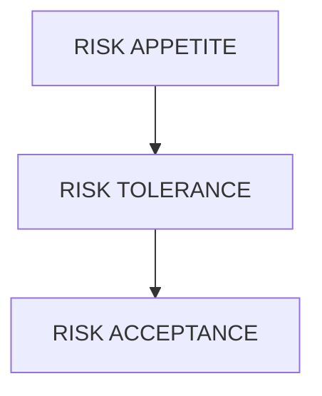

# RISK EVALUATION (EVALUASI RISIKO)**

## 1. Pengantar Evaluasi Risiko


**Risk Evaluation** adalah tahap dalam proses manajemen risiko yang membandingkan hasil **risk analysis** (tingkat risiko) dengan **risk criteria** (kriteria penerimaan risiko) untuk menentukan apakah suatu risiko dapat diterima, perlu dikurangi, atau harus ditangani segera.

Evaluasi risiko menjawab dua pertanyaan utama:

1. **Apakah risiko ini dapat diterima?**
    
2. **Apa tindakan yang harus diambil terhadap risiko tersebut?**
    

---

## 2. Tujuan Evaluasi Risiko

1. Menentukan tingkat prioritas risiko.
    
2. Membantu pengambilan keputusan yang terstruktur berdasarkan bukti.
    
3. Menetapkan apakah suatu risiko berada dalam batas toleransi organisasi.
    
4. Menyusun daftar risiko prioritas untuk mitigasi.
    
5. Mengoptimalkan sumber daya untuk penanganan risiko yang paling kritis.
    
---

## 3. Konsep Dasar dalam Evaluasi Risiko

### 3.1 Risk Criteria (Kriteria Risiko)

Risk criteria adalah standar yang digunakan untuk menilai apakah suatu risiko dapat diterima atau tidak.

Risk criteria dibentuk berdasarkan:

- Regulasi dan standar hukum
    
- Kapabilitas organisasi
    
- Toleransi risiko (risk appetite)
    
- Kapasitas risiko (risk capacity)
    
- Tujuan dan konteks organisasi
    
- Ekspektasi stakeholder
    

Contoh risk criteria:

- Kerugian maksimal yang dapat diterima ≤ Rp 100 juta
    
- Downtime maksimal 2 jam
    
- Zero fatality
    
- Risiko dengan level > 15 (skala 1–25) harus ditindaklanjuti
    

---

## 4. ALARP Principle (As Low As Reasonably Practicable)

**ALARP** adalah pendekatan yang menekankan bahwa risiko harus dikurangi **sejauh mungkin** hingga batas yang **masih wajar dan praktis**.

Zona ALARP terbagi menjadi:

1. **Unacceptable Region** – risiko harus segera diturunkan.
    
2. **ALARP Region** – risiko dapat diterima _jika_ biaya mitigasi tidak proporsional terhadap penurunan risiko.
    
3. **Acceptable Region** – risiko dapat diterima tanpa tindakan tambahan signifikan.
    

### Prinsip ALARP:

- **Reasonably Practicable** artinya tindakan mitigasi dipertimbangkan dari sisi manfaat vs biaya.
    
- Biaya mitigasi tidak boleh **secara tidak proporsional** lebih besar dibanding benefit keselamatan.

### Contoh Penerapan

### 1. Contoh di Industri Manufaktur

#### Kasus:

Mesin produksi memiliki risiko kecelakaan karena tangan pekerja bisa terjepit di bagian rol.  
Analisis risiko menunjukkan:

- **Likelihood:** Medium
- **Consequence:** High (cedera serius)
- **Status:** Risiko berada di **zona ALARP**
    
#### Opsi Mitigasi yang Tersedia:

|Opsi|Deskripsi|Biaya|Penurunan Risiko|
|---|---|---|---|
|A|Pasang pelindung mekanik|Rp 5 juta|Menurunkan likelihood signifikan|
|B|Pasang sensor otomatis berhenti|Rp 120 juta|Penurunan risiko sangat tinggi|
|C|Training tambahan operator|Rp 3 juta|Penurunan risiko kecil|

#### Evaluasi ALARP:
- Training (C) terlalu kecil dampaknya → **tidak cukup**.
- Sensor otomatis (B) sangat efektif tetapi biayanya **tidak proporsional** dengan penurunan risiko.
- Pelindung mekanik (A) menawarkan **penurunan risiko besar dengan biaya wajar** → **practicable**.

#### Keputusan ALARP:
* Pasang **pelindung mekanik** (A).  
* Sensor otomatis (B) tidak wajib karena biaya terlalu besar dibanding manfaatnya → **reasonably practicable** terpenuhi.

---

### 2. Contoh di Keselamatan Kerja (K3) – Paparan Kebisingan

#### Kasus:

Area produksi memiliki kebisingan 88 dB, melebihi batas aman 85 dB.  
Risiko berada di **zona ALARP**.

#### Opsi Mitigasi:
1. Memasang peredam ruangan (biaya tinggi).
2. Memasok earplug standar kepada pekerja (biaya rendah).
3. Memasang barrier akustik tambahan (biaya sedang).

#### Evaluasi:
- Earplug saja cukup untuk menurunkan kebisingan menjadi 80 dB → wajar & efektif.
- Peredam ruangan mahal (ratusan juta) → tidak wajib jika earplug sudah efektif.
- Barrier akustik dipertimbangkan jika earplug tidak cukup.

#### Keputusan ALARP:

→ Berikan **earplug** + SOP penggunaan.  
→ Tidak perlu renovasi akustik kecuali kebisingan tetap tinggi.  
Risiko sudah **serendah yang wajar dan praktis**.

---

### 3. Contoh di Industri Migas

#### Kasus:

Pipa gas mengalami potensi kebocoran kecil.  
Dampak: kebakaran atau ledakan (konsekuensi sangat tinggi).  
Risiko berada antara ALARP dan tidak dapat diterima.

#### Opsi Mitigasi:
- Inspeksi rutin 3 bulan (standar industri)
- Menambah inspeksi bulanan
- Mengganti seluruh pipa dengan material baru (biaya sangat besar)

#### Analisis ALARP:

- Inspeksi bulanan memberikan peningkatan keamanan yang signifikan dengan biaya moderat → **reasonable**
    
- Mengganti seluruh pipa meningkatkan keamanan tetapi biayanya **tidak proporsional** terhadap peningkatan yang diperoleh → **unreasonable**
    

#### Keputusan ALARP:

→ Lakukan inspeksi bulanan.  
Tidak perlu penggantian seluruh pipa karena tidak memenuhi prinsip **reasonably practicable**.

---

### 4. Contoh di Teknologi Informasi

#### Kasus:

Website perusahaan rentan terhadap serangan brute-force.

#### Mitigasi yang mungkin:

|Tindakan|Biaya|Efektivitas|
|---|---|---|
|A. Implementasi CAPTCHA|Rendah|Tinggi|
|B. Implementasi MFA|Sedang|Tinggi|
|C. Penetration testing harian|Sangat tinggi|Tambahan kecil|

#### Evaluasi ALARP:

- CAPTCHA + MFA sudah menurunkan risiko ke tingkat sangat rendah (**practicable**)
    
- Penetration test harian biayanya sangat tinggi dan tidak proporsional
    

#### Keputusan ALARP:

→ Implementasi **CAPTCHA** dan **MFA** saja.  
→ Penetration test dilakukan periodik, tidak perlu harian.

---

### 5. Contoh ALARP dalam Penggunaan Masker Debu

#### Kasus:

Area kerja menghasilkan debu ringan yang tidak berbahaya namun mengganggu.

#### Mitigasi:

- Masker N95 (mahal)
    
- Masker debu biasa (murah dan sudah cukup)
    
- Fogging ruangan setiap hari (sangat mahal)
    

∴ Masker debu ringan **sudah cukup**, sehingga penggunaan masker N95 atau fogging dianggap **tidak reasonably practicable**.

---

### Ringkasan Cara Kerja ALARP dalam Setiap Contoh
1. Identifikasi risiko dan level awalnya.
2. Tentukan opsi mitigasi yang memungkinkan.
3. Nilai **biaya vs manfaat** dari setiap mitigasi.
4. Pilih mitigasi yang **efektif & wajar secara ekonomi**.
5. Abaikan mitigasi yang terlalu mahal dibanding manfaatnya.
6. Dokumentasikan alasan keputusan → bagian penting ALARP.

---

## 5. RISK APPETITE, RISK TOLERANCE, DAN RISK ACCEPTANCE

Dalam manajemen risiko, organisasi tidak bisa menghilangkan semua risiko. Karena itu, diperlukan batasan yang jelas mengenai **seberapa besar risiko yang dapat diterima**, risiko mana yang harus dikendalikan ketat, dan risiko mana yang dapat diambil untuk meraih peluang bisnis.

Tiga konsep penting dalam proses ini adalah:

1. **Risk Appetite** – tingkat risiko yang ingin diterima organisasi.
    
2. **Risk Tolerance** – batas risiko yang masih diperbolehkan.
    
3. **Risk Acceptance** – keputusan untuk menerima risiko tertentu.

Ketiganya membantu organisasi membuat keputusan yang konsisten, terukur, dan selaras dengan tujuan strategis.

---

### 5.1. Risk Appetite

**Risk Appetite** adalah tingkat risiko yang _siap_ atau _bersedia_ diterima organisasi dalam upaya mencapai tujuan strategisnya.

Risk appetite mencerminkan:

- Budaya risiko (risk culture) perusahaan
    
- Keberanian mengambil peluang (risk-taking capacity)
    
- Orientasi bisnis: konservatif vs agresif
    
- Preferensi stakeholder
    
Karakteristik Risk Appetite:

- Bersifat **strategis** dan jangka panjang
    
- Ditentukan oleh pimpinan puncak (Top Management / Board)
    
- Tidak selalu bersifat kuantitatif—dapat berupa pernyataan umum
    
- Menjadi acuan dalam penyusunan risk tolerance dan risk limit


Pernyataan _Risk Appetite_ (Selera Risiko) adalah komponen krusial dalam kerangka kerja manajemen risiko. Pernyataan ini berfungsi sebagai panduan bagi manajemen untuk memutuskan apakah suatu risiko harus **diterima**, **dihindari**, atau **dimitigasi**.

Dalam konteks evaluasi risiko, pernyataan ini adalah tolok ukur (benchmark). Jika level risiko hasil evaluasi melebihi _appetite_, maka tindakan mitigasi wajib dilakukan.

Berikut adalah panduan dan contoh pernyataan _risk appetite_ berdasarkan berbagai kategori risiko dan tingkatannya.

#### 1. Skala Risk Appetite

Sebelum masuk ke contoh, pahami dulu skala umum yang sering digunakan:

- **Averse (Menghindari):** Toleransi sangat rendah (hampir nol). Mengutamakan keamanan di atas keuntungan.
    
- **Minimalist (Hati-hati):** Hanya menerima risiko yang sangat kecil dan terkendali.
    
- **Cautious/Moderate (Seimbang):** Menerima risiko jika potensi keuntungannya sepadan.
    
- **Open/Aggressive (Terbuka):** Berani mengambil risiko besar demi pertumbuhan atau inovasi yang cepat.
    

---

#### 2. Contoh Pernyataan Berdasarkan Kategori Risiko

Berikut adalah contoh kalimat pernyataan yang bisa Anda adaptasi:

##### A. Risiko Keselamatan & Kesehatan Kerja (K3)

_Biasanya menggunakan pendekatan **Averse**._

> "Organisasi memiliki **toleransi nol (zero tolerance)** terhadap segala risiko yang dapat menyebabkan hilangnya nyawa atau cedera fisik serius bagi karyawan maupun kontraktor. Kami akan menghentikan operasional apa pun jika standar keselamatan tidak terpenuhi, tanpa memandang dampak finansial jangka pendek."

##### B. Risiko Kepatuhan & Hukum (Compliance)

_Biasanya menggunakan pendekatan **Averse** atau **Minimalist**._

> "Perusahaan menerapkan sikap **sangat berhati-hati (averse)** terhadap risiko pelanggaran hukum dan regulasi. Kami tidak akan mengejar peluang bisnis yang memiliki potensi melanggar peraturan pemerintah atau kode etik perusahaan, meskipun peluang tersebut sangat menguntungkan secara finansial."

##### C. Risiko Strategis & Inovasi

_Biasanya menggunakan pendekatan **Open** atau **Aggressive** (terutama untuk startup atau divisi R&D)._

> "Untuk mempertahankan posisi sebagai pemimpin pasar, perusahaan memiliki selera risiko yang **tinggi (open)** terhadap inisiatif inovasi digital. Kami bersedia menerima kegagalan pada proyek percontohan (pilot project) dan kerugian investasi awal, asalkan kegagalan tersebut memberikan pembelajaran strategis dan tidak mengganggu arus kas inti perusahaan."

##### D. Risiko Finansial

_Biasanya menggunakan pendekatan **Moderate**._

> "Perusahaan mengambil pendekatan **moderat** terhadap risiko keuangan. Kami bersedia menerima fluktuasi nilai tukar atau pasar saham dalam batas wajar, selama rasio likuiditas tetap di atas 120% dan target EBITDA tahunan tidak tergerus lebih dari 5%."

##### E. Risiko Reputasi

_Biasanya menggunakan pendekatan **Minimalist**._

> "Kami memiliki **selera risiko rendah** terhadap aktivitas yang dapat merusak kepercayaan publik atau citra merek (brand image). Setiap kampanye pemasaran atau komunikasi publik harus melalui evaluasi risiko ketat untuk memastikan tidak ada unsur yang menyinggung isu SARA atau norma sosial."

##### F. Risiko Operasional & Teknologi (Cybersecurity)

_Campuran antara **Minimalist** (untuk data inti) dan **Moderate** (untuk efisiensi sistem)._

> "Terkait keamanan data nasabah, kami **tidak mentoleransi** risiko kebocoran data. Namun, untuk sistem internal non-kritis, kami menerima risiko gangguan sistem sementara (downtime) maksimal 4 jam per bulan demi efisiensi biaya infrastruktur IT."

---

#### 3. Matriks Evaluasi: Menghubungkan Pernyataan dengan Tindakan

Dalam dokumen evaluasi risiko, pernyataan di atas diterjemahkan ke dalam tindakan seperti ini:

|**Kategori Risiko**|**Risk Appetite**|**Hasil Evaluasi Risiko (Contoh)**|**Keputusan / Tindakan**|
|---|---|---|---|
|**K3 (Safety)**|Averse (Sangat Rendah)|**Medium** (Ada potensi cedera ringan)|**MITIGASI SEGERA:** Risiko ini di atas appetite (Low), wajib diturunkan segera.|
|**Inovasi**|Open (Tinggi)|**High** (Potensi gagal produk baru tinggi)|**TERIMA (ACCEPT):** Masih dalam batas selera risiko untuk inovasi. Lanjutkan dengan monitoring.|
|**Keuangan**|Moderate (Sedang)|**Extreme** (Potensi bangkrut)|**HINDARI (AVOID):** Risiko terlalu besar melampaui appetite. Batalkan investasi.|

---

#### 4. Tips Menyusun Pernyataan yang Efektif

1. **Spesifik:** Jangan hanya bilang "Kami mau aman." Gunakan parameter jika mungkin (misal: "Kerugian tidak lebih dari 10%").
    
2. **Selaras dengan Tujuan:** Pastikan _appetite_ inovasi tidak bertentangan dengan target pertumbuhan agresif.
    
3. **Dikomunikasikan:** Semua manajer harus tahu batasannya agar mereka berani mengambil keputusan (atau berhenti) tanpa harus selalu bertanya ke Direksi.
    

---

### 5.2. Risk Tolerance

**Risk Tolerance** adalah batas maksimum deviasi risiko yang boleh diterima organisasi dalam menjalankan proses operasional.

Jika risk appetite adalah “niat strategis”, maka risk tolerance adalah **angka operasional** yang konkret.

Risk tolerance dapat berupa:

- batas kuantitatif (data angka, KPI, indikator)
    
- standar minimum atau maksimum
    
- batas waktu kerusakan
    
- batas biaya kerugian

#### Hubungan dengan Risk Appetite

```
Risk Appetite → Pernyataan umum
Risk Tolerance → Batas kuantitatif yang dapat diukur
Risk Limit → Angka taktis yang menjadi panduan harian
```

Contoh:

- Risk Appetite: “Kami menerima risiko keuangan moderat.”
    
- Risk Tolerance: “Kerugian finansial maksimal Rp 200 juta per proyek.”
    
- Risk Limit: “Setiap transaksi tidak boleh melebihi Rp 50 juta.”
    

#### Contoh Risk Tolerance Operasional

- Downtime sistem maksimal: **2 jam**
    
- Kesalahan produksi maksimal: **1% produk**
    
- Kerugian kredit macet maksimal: **3%** dari total portofolio
    
- Waktu respon komplain pelanggan: **≤ 24 jam**
    
- Tingkat kecacatan (defect rate): **≤ 500 ppm**

---

### 5.3. Risk Acceptance

**Risk Acceptance** adalah keputusan untuk menerima risiko tertentu tanpa tindakan mitigasi tambahan, karena risiko tersebut:

- rendah
    
- biayanya tidak layak untuk diturunkan
    
- sudah berada dalam batas risk tolerance
    
- mitigasi tidak memberikan manfaat signifikan
    
- berada dalam zona ALARP (As Low As Reasonably Practicable)
    

Risk acceptance harus **didokumentasikan** dan **disetujui secara formal**.

#### Situasi yang Tepat untuk Risk Acceptance

1. Risiko memiliki nilai kerugian yang kecil.
    
2. Probabilitas risiko sangat rendah.
    
3. Biaya mitigasi lebih tinggi dari nilai risiko.
    
4. Risiko tidak dapat diturunkan dengan teknologi atau metode yang tersedia.
    
5. Risiko sudah berada dalam batas toleransi risiko organisasi.

#### Contoh Risk Acceptance

- Perusahaan menerima risiko _downtime_ 15 menit saat peralihan server mingguan.
    
- Perusahaan menerima risiko _fluktuasi ringan_ pada harga bahan baku.
    
- Departemen menerima risiko kehilangan barang kecil (alat kantor ≤ Rp 500 ribu).
    
- Perusahaan e-commerce menerima risiko _fraud_ rendah ≤ 0,2%.

---

### 5.4. Hubungan antara Risk Appetite, Risk Tolerance, dan Risk Acceptance



- **Risk Appetite** → level risiko yang diinginkan secara strategis
    
- **Risk Tolerance** → batas operasional yang tidak boleh dilampaui
    
- **Risk Acceptance** → keputusan menerima risiko tertentu

---

### 5.5. Contoh Kasus Integratif

**Kasus: Perusahaan Teknologi**

**Risk Appetite:**  
“Kami menerima risiko moderat terkait down-time untuk menjaga efisiensi biaya.”

**Risk Tolerance:**

- Maksimal downtime sistem: 2 jam per bulan
    
- Maksimal keluhan pengguna: 1% dari total transaksi
    

**Risk Acceptance:**

- Perusahaan menerima risiko downtime 20 menit saat patching sistem mingguan
    
- Karena durasinya masih jauh di bawah batas toleransi (2 jam)
    

---

### 5.6. Mengapa Ketiga Konsep Ini Penting?

1. Menyelaraskan risiko dengan tujuan strategis.
    
2. Memberikan batasan yang jelas bagi setiap level organisasi.
    
3. Membantu alokasi sumber daya mitigasi risiko secara optimal.
    
4. Menghindari dua ekstrem: terlalu berani atau terlalu konservatif.
    
5. Membuat keputusan risiko lebih konsisten dan dapat dipertanggungjawabkan.
    

---

### 5.7. Perbedaan Utama Ketiga Konsep

|Aspek|Risk Appetite|Risk Tolerance|Risk Acceptance|
|---|---|---|---|
|Level|Strategis|Operasional|Keputusan spesifik|
|Sifat|Kualitatif|Kuantitatif|Situasional|
|Penentu|Direksi / Top Management|Manajemen menengah|Pemilik risiko|
|Fungsi|Menentukan arah|Menetapkan batas|Menerima risiko|
|Durasi|Jangka panjang|Jangka menengah|Jangka pendek / insidental|
Sebagai rangkuman, perbedaan dari ketiga konsep ini adalah sebagai berikut:
- **Risk Appetite** → preferensi risiko secara strategis
- **Risk Tolerance** → batas risiko yang diperbolehkan
- **Risk Acceptance** → keputusan menerima risiko tertentu  
    Ketiganya saling melengkapi dan merupakan fondasi penting dalam membangun kerangka manajemen risiko yang kuat.

---

### 5.8. Prinsip Penyusunan Risk Appetite & Tolerance

1. Align dengan visi dan misi organisasi.
    
2. Melibatkan top management dan pemilik risiko.
    
3. Menggunakan data historis.
    
4. Mengikuti regulasi dan standar industri.
    
5. Menggunakan indikator kuantitatif.
    
6. Mudah dipahami dan dikomunikasikan.
    
---

## **6. Metode Evaluasi Risiko**

Evaluasi risiko dilakukan dengan membandingkan hasil analisis risiko dengan kriteria.  
Beberapa metode yang digunakan:

### 6.1 Risk Matrix (Metode Paling Umum)

Matriks 5x5 atau 3x3 digunakan menggabungkan:

- **Likelihood (kemungkinan)**
    
- **Consequence (dampak)**
    

Contoh matriks 5x5:

|Probability / Impact|1|2|3|4|5|
|---|---|---|---|---|---|
|**5**|M|H|H|E|E|
|**4**|M|M|H|H|E|
|**3**|L|M|M|H|H|
|**2**|L|L|M|M|H|
|**1**|L|L|L|M|M|

Keterangan:  
L = Low, M = Medium, H = High, E = Extreme

**Interpretasi hasil:**

- High & Extreme → mitigasi wajib
    
- Medium → dipantau & mitigasi bila perlu
    
- Low → diterima
    

---

### 6.2 Cost–Benefit Analysis (CBA) dalam Evaluasi Risiko

**Cost–Benefit Analysis (CBA)** adalah metode untuk membandingkan **biaya** dari suatu tindakan mitigasi risiko dengan **manfaat** yang diperoleh dari pengurangan risiko tersebut.

Tujuan CBA adalah memastikan bahwa tindakan mitigasi:

- **Layak secara ekonomi**
    
- **Efisien** (manfaat lebih besar dari biaya)
    
- **Rasional** untuk diterapkan berdasarkan data risiko
    

CBA membantu memastikan bahwa sumber daya organisasi digunakan pada mitigasi yang **paling efektif** dan **proposional** terhadap risiko yang dikurangi.

#### Peran CBA dalam Evaluasi Risiko

Dalam evaluasi risiko, CBA digunakan untuk:

1. **Menilai apakah kontrol risiko perlu diterapkan atau tidak**
    
    - Apakah mitigasi tersebut memberikan manfaat yang sebanding dengan biaya?
        
2. **Membandingkan berbagai alternatif kontrol risiko**
    
    - Pilih mitigasi yang paling efisien dan memberikan nilai tambah terbesar.
        
3. **Mendukung keputusan ALARP (As Low As Reasonably Practicable)**
    
    - CBA menentukan apakah biaya mitigasi wajar atau tidak sebanding.
        
4. **Justifikasi anggaran**
    
    - Untuk meyakinkan manajemen bahwa implementasi mitigasi tertentu layak secara finansial.
        

---

#### Komponen CBA dalam Evaluasi Risiko

CBA menghitung dua elemen utama:

##### A. Cost (Biaya)

Meliputi:

- Biaya investasi awal (capital cost)
    
- Biaya operasional dan pemeliharaan
    
- Biaya pelatihan
    
- Biaya downtime saat implementasi
    
- Biaya administratif
    

##### B. Benefit (Manfaat)

Dalam konteks risiko, manfaat terutama berasal dari:

- **Pengurangan likelihood (probabilitas risiko)**
    
- **Pengurangan consequence (dampak kerugian)**
    
- **Pengurangan biaya insiden** di masa depan
    
- **Menghindari denda/regulasi**
    
- **Meningkatkan produktivitas**
    
- **Peningkatan reputasi dan kepercayaan**
    

Manfaat sering dihitung menggunakan **Expected Monetary Value (EMV)**


---

#### Langkah-Langkah Melakukan CBA untuk Evaluasi Risiko

##### Langkah 1: Mengidentifikasi risiko

Contoh: Kecelakaan mesin yang dapat menimbulkan kerugian Rp 200 juta.

##### Langkah 2: Mengestimasi kerugian tanpa mitigasi

$$EMV = \text{Probabilitas} \times \text{Dampak}$$

Misal:

- Probabilitas insiden = 10%
    
- Dampak = Rp 200 juta  
    → EMV = Rp 20 juta/tahun
    

##### Langkah 3: Mengestimasi efektivitas mitigasi

Contoh: Memasang guard akan menurunkan probabilitas dari 10% menjadi 2%.


##### Langkah 4: Menghitung manfaat mitigasi

Manfaat = pengurangan EMV

Sebelum mitigasi:

- EMV = 0,10 × 200 juta = **20 juta**
    

Sesudah mitigasi:

- EMV = 0,02 × 200 juta = **4 juta**
    

→ Pengurangan kerugian = 16 juta

##### Langkah 5: Menghitung biaya mitigasi

Misal:

- Biaya pemasangan guard = 8 juta (sekali biaya)
    
- Biaya perawatan tahunan = 1 juta
    


##### Langkah 6: Membandingkan Cost dan Benefit

Jika:

- Benefit tahunan = **Rp 16 juta**
    
- Cost tahunan (amortisasi + maintenance) = misal **Rp 4 juta**
    

Tindakan mitigasi **layak**, karena manfaat > biaya.

---

#### Analisis Lebih Lanjut: Net Benefit dan BCR

Ada dua metode umum:

##### A. Net Benefit

$$Net Benefit = Benefit - Cost$$  
Jika hasil positif → mitigasi layak.

##### B. Benefit–Cost Ratio (BCR)

$$BCR = \frac{Benefit}{Cost}$$  
Interpretasi:

- BCR > 1 → layak
    
- BCR < 1 → tidak layak
    

Contoh:  
$$BCR = \frac{16}{4} = 4$$  
Artinya, setiap Rp 1 biaya mitigasi menghasilkan Rp 4 manfaat → sangat layak.

---

#### Contoh Lengkap Penerapan CBA dalam Evaluasi Risiko

**Kasus: Risiko Kebakaran Gudang**

- Dampak kebakaran: Rp 5 miliar
    
- Probabilitas: 1% per tahun
    
- EMV tanpa mitigasi:  
    $$0.01 \times 5.000.000.000 = Rp 50.000.000$$
    

**Mitigasi: Sistem Sprinkler**

- Biaya pemasangan: Rp 300 juta
    
- Biaya maintenance: Rp 10 juta/tahun
    
- Penurunan probabilitas kebakaran menjadi 0,2%
    
- EMV sesudah mitigasi:  
    $0.002 \times 5.000.000.000 = Rp 10.000.000$
    
- Manfaat mitigasi:  
    $50 - 10 = Rp 40 juta/tahun$
    

**Amortisasi biaya pemasangan (misal 10 tahun):**

$300/10 = 30 juta/tahun$

Total biaya tahunan = 30 + 10 = 40 juta

**Analisis:**

- Benefit = 40 juta
    
- Cost = 40 juta  
    → _Break-even_ → borderline, tapi secara keselamatan biasanya tetap diwajibkan.
    

---

#### Keterkaitan CBA dengan ALARP

CBA sering digunakan untuk memutuskan apakah biaya mitigasi masih:

- **Reasonably Practicable** atau
    
- **Tidak sebanding dengan manfaatnya**
    

**Jika biaya >> manfaat** → mitigasi tidak wajib  
**Jika biaya << manfaat** → mitigasi harus dilakukan

Ini sebabnya CBA merupakan metode inti dalam implementasi prinsip ALARP.

---

#### Keterbatasan CBA dalam Evaluasi Risiko

- Sulit mengukur kerugian non-finansial (nyawa, reputasi, moral).
    
- Asumsi probabilitas mungkin tidak akurat.
    
- Benefit sering tidak terlihat langsung (_intangible_).
    
- Biaya tidak selalu linear dari waktu ke waktu.
    
- Terkadang bertentangan dengan regulasi yang bersifat “zero tolerance”.
    

Karena itu, CBA harus dikombinasikan dengan:

- Analisis kualitatif
    
- Penilaian ahli (_expert judgment_)
    
- Kepatuhan regulasi
    
---

## 7. Langkah-Langkah dalam Risk Evaluation

1. **Menetapkan risk criteria** sesuai konteks organisasi.
    
2. **Menganalisis tingkat risiko** (hasil risk analysis).
    
3. **Membandingkan nilai risiko dengan kriteria** (risk appetite / tolerance).
    
4. **Menentukan status risiko**:    
    - diterima        
    - dikurangi        
    - ditransfer        
    - dihindari
        
5. **Menentukan prioritas risiko** untuk treatment.
    
6. **Mendokumentasikan hasil** evaluasi.
    
7. **Mengkomunikasikan hasil** kepada stakeholder.
    

---

## 8. Contoh Kasus Evaluasi Risiko


Perusahaan memiliki risiko “Downtime Server”.

- Probability = 4
    
- Impact = 5
    
- Risk Score = 20 (High)
    
- Risk Tolerance perusahaan untuk downtime = maks 2 jam, kerugian ≤ Rp 50 juta
    

**Analisis**:

- Downtime berpotensi >4 jam → melebihi toleransi
    
- Kerugian > Rp 150 juta → melebihi toleransi
    
- Masuk zona **Unacceptable / High**
    

**Kesimpulan Evaluasi**:  
→ Harus dilakukan mitigasi segera: upgrade server, failover system, atau backup infrastruktur.

---

## 9. Output dari Risk Evaluation

Hasil evaluasi risiko biasanya berbentuk:

1. **Daftar prioritas risiko**
    
2. **Keputusan rekomendasi penanganan** (treat/transfer/avoid/accept)
    
3. **Dokumen risk acceptance untuk risiko yang diterima**
    
4. **Input ke tahap Risk Treatment**
    

---

 ## 10. Ringkasan

|Elemen|Penjelasan|
|---|---|
|Risk Evaluation|Membandingkan tingkat risiko dengan kriteria|
|Risk Criteria|Standar penerimaan risiko|
|ALARP|Risiko harus ditekan sebatas yang wajar|
|Risk Appetite|Keinginan mengambil risiko|
|Risk Tolerance|Batas toleransi kuantitatif|
|Prioritization|Mengurutkan risiko berdasarkan nilai kritis|
|Output|Keputusan evaluasi & prioritas mitigasi|

---

## 💼 Diskusi & Tugas

Pelajari contoh kasus berikut:
1. [Contoh Kasus Evaluasi Risiko dengan Pendekatan ALARP - Kebocoran Gas](/docs/artikel/contoh-alarp-1.md)
2. [**Contoh Kasus Evaluasi Risiko (ALARP) – Pembangunan Sistem E-Commerce**](docs/artikel/contoh-alarp-2.md)
3. [Contoh Kasus Evaluasi Risiko – Pendekatan ALARP - Bisnis Franchise Ayam Goreng](/docs/artikel/contoh-alarp-3.md)