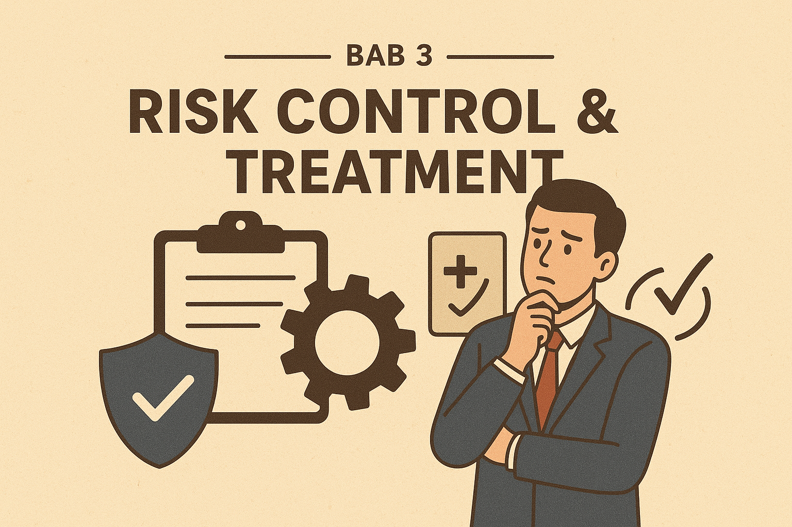

# **RISK CONTROL & TREATMENT (PENGENDALIAN DAN PENANGANAN RISIKO)**

## 1. Pendahuluan

Setelah risiko dievaluasi dan diprioritaskan, langkah berikutnya adalah melakukan **Risk Control & Treatment**, yaitu proses memilih dan menerapkan langkah-langkah untuk **mengurangi, menghindari, memindahkan, atau menerima risiko** sesuai dengan kapasitas dan strategi organisasi.

Tujuan utama risk control & treatment adalah **meminimalkan dampak negatif risiko** dan **memaksimalkan peluang (opportunity)** yang muncul.

---

## 2. Tujuan Risk Control & Treatment

1. Menurunkan tingkat risiko hingga berada pada batas yang dapat diterima (acceptable level).
    
2. Menyediakan strategi yang efektif dan efisien dalam mengelola risiko.
    
3. Melindungi aset organisasi (SDM, keuangan, reputasi, teknologi, dll).
    
4. Memastikan kelangsungan operasi (business continuity).
    
5. Memenuhi standar, regulasi, dan kepatuhan hukum.
    

---

## 3. Proses Risk Treatment

### 3.1 Identifikasi Opsi Risk Treatment

Menurut **ISO 31000:2018**, terdapat beberapa opsi penanganan risiko:

1. **Risk Avoidance (Menghindari Risiko)**
    - Menghentikan aktivitas yang menimbulkan risiko.
    - Contoh: perusahaan menolak proyek yang terlalu berisiko secara hukum.
        
2. **Risk Reduction / Mitigation (Mengurangi Risiko)**
    - Mengambil tindakan untuk menurunkan probabilitas atau dampak risiko.
    - Contoh: 
	    - pemasangan CCTV
	    - Pemasangan firewall
	    - pelatihan K3 (Keselamatan & Kesehatan Kerja).
        
3. **Risk Transfer / Sharing (Memindahkan Risiko)**
    - Risiko dialihkan ke pihak lain melalui kontrak atau asuransi.
    - Contoh: perusahaan membeli asuransi kebakaran untuk gudang.
        
4. **Risk Acceptance (Menerima Risiko)**
    - Menyadari risiko dan siap menanggung konsekuensinya jika terjadi.
    - Cocok untuk risiko dengan probabilitas rendah dan dampak kecil.
        
5. **Risk Exploitation / Enhancement (Mengoptimalkan Peluang)**
    - Tidak semua risiko bersifat negatif; beberapa risiko dapat dikelola untuk menghasilkan keuntungan.
    - Contoh: investasi pada teknologi baru yang berisiko tinggi, tetapi berpotensi besar meningkatkan keuntungan.
    
### 3.2 Evaluasi dan Pemilihan Opsi Risk Treatment

Setiap opsi dianalisis menggunakan kriteria seperti:
- Tingkat pengurangan risiko (residual risk),
- Kesesuaian dengan risk appetite,
- Biaya dan manfaat (Cost-Benefit Analysis / CBA),
- Kelayakan teknis dan operasional,
- Dampak terhadap proses bisnis lain,
- Kepatuhan terhadap regulasi.

Output tahap ini adalah **opsi treatment terpilih** untuk setiap risiko prioritas.

### 3.3 Penyusunan Risk Treatment Plan (RTP)

Risk treatment plan merupakan dokumen formal yang memuat:
- Risiko yang ditangani,
- Strategi treatment yang dipilih,
- Tindakan pengendalian spesifik,
- Penanggung jawab (risk owner),
- Sumber daya dan anggaran,
- Jadwal implementasi,
- Target level residual risk,
- Indikator kinerja dan efektivitas kontrol.

RTP menjadi acuan utama dalam implementasi.

### 3.4 Implementasi Risk Treatment

Pada tahap ini, organisasi:
- Menerapkan kontrol yang telah direncanakan,
- Mengintegrasikan kontrol ke dalam proses bisnis,
- Mengkomunikasikan perubahan kepada pihak terkait,
- Memberikan pelatihan dan sosialisasi bila diperlukan.

Keberhasilan tahap ini sangat bergantung pada **komitmen manajemen** dan **disiplin operasional**.

### 3.5 Monitoring dan Review Risk Treatment

Setelah implementasi, efektivitas risk treatment harus dipantau melalui:
- Key Risk Indicators (KRI),
- Audit internal,
- Insiden dan near-miss,
- Review berkala tingkat residual risk.

Jika risk treatment tidak efektif atau konteks berubah, maka dilakukan **penyesuaian atau treatment ulang**.

---

## 4. Faktor yang Dipertimbangkan dalam Risk Treatment

- **Kriteria Risiko:** apakah level risiko melebihi risk appetite organisasi.
    
- **Sumber Daya:** biaya, SDM, teknologi yang tersedia.
    
- **Efektivitas:** seberapa besar mitigasi menurunkan risiko.
    
- **Regulasi & Kepatuhan:** apakah tindakan memenuhi persyaratan hukum.
    
- **Dampak Residual Risk:** risiko yang tersisa setelah dilakukan kontrol.
    

---

## 5. Contoh Kasus

**Kasus: Risiko Gangguan Sistem E-Learning di Perguruan Tinggi**

- Risiko: Server down saat ujian online.
    
- Strategi: **Risk Reduction.**
    
- Tindakan: Menambah kapasitas server, menyediakan backup server, melakukan uji coba beban.
    
- Hasil: Probabilitas gangguan berkurang dari “tinggi” menjadi “rendah”.
    

