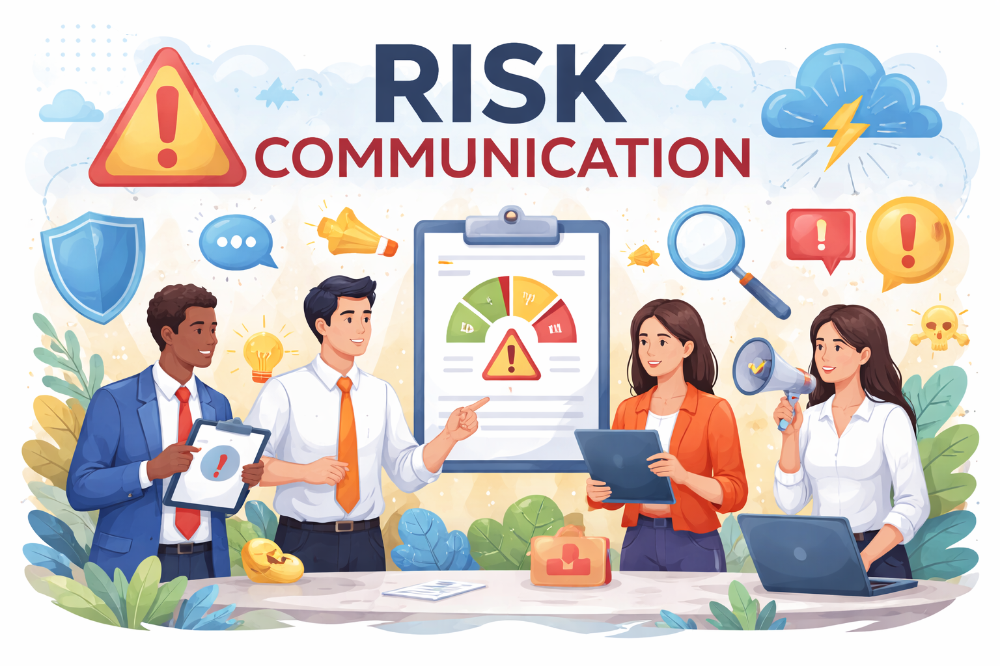

 
# **RISK COMMUNICATION

---
## 1. Pengertian Risk Communication

**Risk Communication** adalah proses **pertukaran informasi, pandangan, dan persepsi mengenai risiko** antara organisasi dan para pemangku kepentingan (stakeholders), baik internal maupun eksternal, secara **terstruktur, transparan, dan berkelanjutan**, dengan tujuan mendukung **pengambilan keputusan yang tepat terkait risiko**.

Menurut ISO 31000, *risk communication* merupakan bagian integral dari proses **risk management**, yang memastikan bahwa:
- Risiko dipahami dengan benar,
- Keputusan risiko dapat diterima secara rasional,
- Tindakan pengendalian risiko mendapat dukungan pihak terkait.

Risk communication **bukan sekadar penyampaian informasi**, tetapi mencakup dialog dua arah dan pengelolaan persepsi risiko.

---

## 2. Tujuan Risk Communication

Menurut ISO 31000, risk communication bertujuan untuk:

1. **Meningkatkan pemahaman risiko**
    - Menjelaskan sifat risiko, sumber, dampak, dan tingkat keparahan.
        
2. **Menyelaraskan persepsi risiko**
    - Mengurangi kesenjangan antara risiko yang dinilai secara teknis dan risiko yang dirasakan (perceived risk).
        
3. **Mendukung pengambilan keputusan**
    - Memberikan dasar informasi yang memadai untuk risk acceptance, risk treatment, atau risk transfer.
        
4. **Membangun kepercayaan (trust)**
    - Transparansi meningkatkan kredibilitas organisasi.
        
5. **Mendorong kepatuhan dan partisipasi**
    - Stakeholder memahami peran dan tanggung jawab mereka dalam pengelolaan risiko.

---

## 3. Stakeholders dalam Risk Communication

**Stakeholder Internal**
- Dewan direksi
- Manajemen puncak
- Manajer unit
- Karyawan operasional
- Tim K3, audit, compliance, risk officer

**Stakeholder Eksternal**
- Regulator
- Investor dan pemegang saham
- Pelanggan
- Pemasok
- Masyarakat sekitar
- Media massa

Setiap stakeholder memiliki:
- Tingkat pemahaman risiko yang berbeda,
- Kepentingan dan sensitivitas yang berbeda,
- Kebutuhan komunikasi yang berbeda.

---

## 4. Prinsip-Prinsip Risk Communication

Berikut adalah penjelasan **Prinsip Utama dalam Klausul Communication & Consultation** berdasarkan **ISO 31000:2018**.

### 4.1. Terencana dan Terstruktur (Planned & Structured)

> Communication & Consultation harus dirancang secara formal sebagai bagian dari sistem manajemen risiko, bukan aktivitas ad hoc.

**Implikasi praktis:**
- Terdapat rencana komunikasi risiko (risk communication plan).
- Penetapan:
    - Pemangku kepentingan (stakeholder)
    - Tujuan komunikasi
    - Media dan frekuensi
    - Penanggung jawab

**Risiko jika diabaikan:**  
Informasi risiko menjadi sporadis, tidak konsisten, dan sulit ditindaklanjuti.

### 4.2. Berkelanjutan (Ongoing)

> Komunikasi dan konsultasi dilakukan **sepanjang siklus manajemen risiko**, bukan hanya pada tahap tertentu.

**Implikasi praktis:**
- Dilakukan sebelum, selama, dan setelah proses risk assessment.
- Disesuaikan dengan perubahan konteks internal dan eksternal.
    
**Nilai tambah:**  
Organisasi mampu mendeteksi perubahan profil risiko lebih dini.

### 4.3. Inklusif dan Melibatkan Pemangku Kepentingan (Inclusive)

> ISO 31000 menekankan pentingnya melibatkan stakeholder yang relevan, baik internal maupun eksternal.

**Implikasi praktis:**
- Stakeholder dilibatkan dalam:
    - Identifikasi risiko
    - Penilaian dampak
    - Penentuan respon risiko
- Perspektif beragam meningkatkan kualitas analisis risiko.

**Contoh stakeholder:**  
Manajemen puncak, unit operasional, auditor, regulator, mitra bisnis.

### 4.4. Dua Arah dan Partisipatif (Two-Way Process)

> Communication & Consultation bukan sekadar penyampaian informasi satu arah, melainkan dialog.

**Implikasi praktis:**
- Tersedia mekanisme umpan balik.
- Diskusi dan klarifikasi menjadi bagian proses.

**Dampak positif:**
- Meningkatkan akurasi penilaian risiko.
- Memperkuat kredibilitas.

### 4.5. Relevan dan Kontekstual (Relevant & Context-Specific)

> Informasi risiko harus disesuaikan dengan kebutuhan, peran, dan kepentingan audiens.

**Implikasi praktis:**
- Manajemen puncak: fokus pada risiko strategis dan implikasi keputusan.
- Level operasional: fokus pada kontrol dan prosedur.
- Pihak eksternal: fokus pada kepatuhan dan dampak.

**Prinsip kunci:**  
Satu pesan risiko tidak cocok untuk semua pihak.

### 4.6. Jelas, Akurat, dan Dapat Dipahami (Clear & Accurate)

> Informasi risiko harus berbasis data yang valid dan disampaikan secara sederhana.

**Implikasi praktis:**
- Menghindari istilah teknis berlebihan tanpa penjelasan.
- Konsistensi data antar laporan dan unit.

**Konsekuensi jika gagal:**  
Kesalahpahaman risiko dan keputusan yang keliru.

### 4.7. Tepat Waktu (Timely)

> Informasi risiko harus disampaikan saat masih relevan untuk pengambilan keputusan.

**Implikasi praktis:**
- Mekanisme eskalasi risiko diterapkan.
- Early warning lebih diutamakan dibanding laporan yang terlambat.

**Contoh:**  
Peringatan dini risiko keselamatan kerja sebelum terjadi insiden.

### 4.8. Mendukung Pengambilan Keputusan (Decision-Oriented)

> Communication & Consultation harus mengarahkan pada tindakan, bukan sekadar pelaporan.

Informasi risiko dikaitkan dengan:
- Tujuan organisasi
- Risk appetite dan risk tolerance
- Alternatif perlakuan risiko

**Nilai strategis:**  
Manajemen dapat membuat keputusan yang sadar risiko (_risk-informed decision_).

### 4.9. Membangun Kepercayaan dan Kredibilitas (Trust & Credibility)

> Keberhasilan komunikasi risiko sangat bergantung pada kepercayaan terhadap sumber informasi.

**Implikasi praktis:**
- Orang yang mengkomunikasikan risiko memiliki kompetensi dan otoritas.
- Konsistensi pesan meningkatkan kredibilitas.

### 4.10. Terintegrasi dengan Sistem Manajemen Risiko

>Communication & Consultation harus menyatu dengan proses dan tata kelola RMS.

**Implikasi praktis:**
- Terhubung dengan risk assessment, risk treatment, dan risk monitoring.
- Menjadi bagian dari budaya organisasi.

---

## 5. Risk Communication dalam Situasi Krisis

### 5.1. Pengertian

**Risk Communication dalam situasi kritis** adalah proses penyampaian dan pertukaran informasi risiko yang dilakukan **dalam kondisi darurat atau krisis**, ketika:
- Risiko telah terwujud atau hampir terwujud
- Dampak bersifat tinggi dan segera
- Ketidakpastian meningkat
- Tekanan waktu dan emosional sangat tinggi

Tujuan utamanya adalah **melindungi keselamatan**, **mengendalikan dampak**, dan **menjaga kepercayaan pemangku kepentingan**.

---

### 5.2. Karakteristik Situasi Kritis

Situasi kritis memiliki ciri khas yang membedakannya dari kondisi normal:

- **Waktu terbatas** untuk pengambilan keputusan
    
- **Informasi belum lengkap** dan terus berubah
    
- **Dampak signifikan** (keselamatan, reputasi, keuangan, hukum)
    
- **Tingkat kepanikan dan emosi tinggi**
    
- **Sorotan publik dan media** meningkat
    

Implikasinya, pendekatan komunikasi risiko harus **adaptif dan responsif**.

---

### 5.3. Tujuan Utama Risk Communication dalam Situasi Kritis

1. **Melindungi keselamatan jiwa dan aset**
    
2. **Memberikan arahan yang jelas dan dapat ditindaklanjuti**
    
3. **Mengurangi kepanikan dan misinformasi**
    
4. **Menjaga kredibilitas dan reputasi organisasi**
    
5. **Mendukung koordinasi pengendalian krisis**
    

---

### 5.4. Prinsip Kunci Risk Communication dalam Situasi Kritis

#### 🔷 Kecepatan dan Ketepatan (Speed with Accuracy)

- Informasi harus disampaikan **secepat mungkin**, meskipun belum sepenuhnya lengkap.
- Ketidakpastian perlu dinyatakan secara terbuka.

**Prinsip operasional:**
> “First, fast, and factual.”

#### 🔷 Kejelasan dan Kesederhanaan Pesan
- Gunakan pesan singkat, langsung, dan tidak ambigu.
- Fokus pada:
    - Apa yang terjadi
    - Apa risikonya
    - Apa yang harus dilakukan

**Hindari:**  
- Bahasa teknis dan penjelasan panjang.

#### 🔷 Konsistensi Sumber dan Pesan
- Tetapkan **satu sumber resmi** (spokesperson).
- Pastikan semua saluran menyampaikan pesan yang sejalan.
- Pesan yang disampaikan harus konsisten

**Tujuan:**  
- Menghindari pesan yang saling bertentangan dan rumor.

#### 🔷 Transparansi dan Kejujuran
- Jangan menunda atau menutup-nutupi fakta penting.
- Akui keterbatasan informasi dan kesalahan bila terjadi.

**Dampak positif:** Transparansi menurunkan eskalasi krisis reputasi.

#### 🔷 Empati dan Sensitivitas
- Akui dampak emosional terhadap korban dan stakeholder.
- Hindari nada defensif atau menyalahkan pihak lain.- 

**Contoh pendekatan:**  
Menyampaikan kepedulian sebelum penjelasan teknis.

#### 🔷 Berorientasi Tindakan (Action-Oriented)
- Setiap komunikasi harus memuat **instruksi jelas**.
- Menjawab pertanyaan: _“Apa yang harus saya lakukan sekarang?”_

---

### 5.5. Tahapan Risk Communication dalam Situasi Kritis

#### 1. Fase Pra-Krisis
- Menyusun **crisis communication plan**
- Menetapkan:
    - Tim krisis
    - Jalur komunikasi
    - Template pesan
- Melakukan simulasi dan latihan (_crisis drill_)

#### 2. Fase Saat Krisis
- Aktivasi tim komunikasi krisis
- Penyampaian pesan awal (_initial statement_)
- Pembaruan informasi secara berkala

#### 3. Fase Pasca-Krisis
- Komunikasi evaluasi dan pembelajaran
- Pemulihan kepercayaan stakeholder
- Pelaporan perbaikan dan tindakan korektif

---

### 5.6. Contoh Skenario Risk Communication

#### SKENARIO 1: Kecelakaan Kerja Serius di Area Produksi

**Deskripsi Krisis**  
Terjadi kecelakaan kerja di area produksi akibat kegagalan mesin, menyebabkan satu pekerja luka berat dan menghentikan sementara operasi.

**Tujuan Komunikasi**
- Melindungi keselamatan pekerja lain
- Mengendalikan situasi dan mencegah kepanikan
- Menyampaikan informasi faktual dan instruksi jelas

**Pesan Komunikasi Internal (Pekerja & Manajemen)**

**Pesan awal (≤ 1 jam):**

> “Telah terjadi kecelakaan kerja di Area Produksi Line 3 pada pukul 09.15 WIB. Operasi di area tersebut dihentikan sementara. Korban telah dievakuasi dan mendapat penanganan medis. Seluruh karyawan diminta menjauhi area kejadian dan mengikuti instruksi tim K3.”

**Pesan lanjutan:**

> “Investigasi awal menunjukkan adanya gangguan teknis pada mesin. Inspeksi keselamatan sedang dilakukan. Operasi hanya akan dilanjutkan setelah dinyatakan aman.”

**Prinsip yang diterapkan**
- Cepat dan faktual
- Berorientasi tindakan
- Fokus keselamatan

---

#### SKENARIO 2: Kebocoran Data Pelanggan (Cyber Incident)

**Deskripsi Krisis**  
Sistem TI perusahaan mengalami serangan siber yang berpotensi mengekspos data pelanggan.

**Tujuan Komunikasi**
- Mengurangi dampak reputasi
- Menjaga kepercayaan pelanggan
- Memenuhi kewajiban transparansi
    
**Pesan Komunikasi Eksternal (Pelanggan)**

**Pesan awal:**

> “Kami menginformasikan bahwa pada tanggal 12 Mei 2025 terjadi insiden keamanan siber yang memengaruhi sebagian sistem kami. Saat ini, investigasi sedang berlangsung untuk memastikan jenis dan cakupan data yang terdampak.”

**Pesan tindak lanjut:**

> “Sebagai langkah pencegahan, kami menyarankan pelanggan untuk mengganti kata sandi akun dan meningkatkan kewaspadaan terhadap aktivitas mencurigakan. Kami akan memberikan pembaruan secara berkala.”

**Prinsip yang diterapkan**
- Transparansi
- Kejujuran atas ketidakpastian
- Empati dan tanggung jawab

---

#### SKENARIO 3: Gangguan Layanan Publik Kritis

**Deskripsi Krisis**  
Terjadi pemadaman sistem layanan utama (misalnya listrik, air, atau sistem pembayaran) yang berdampak luas kepada masyarakat.

**Tujuan Komunikasi**
- Memberikan kejelasan situasi
- Mengurangi kepanikan publik
- Menyampaikan estimasi pemulihan
    
**Pesan Komunikasi Publik**

**Pesan awal:**

> “Saat ini terjadi gangguan pada sistem layanan kami sejak pukul 14.30 WIB. Tim teknis sedang melakukan penanganan darurat. Kami mohon maaf atas ketidaknyamanan yang terjadi.”

**Pesan lanjutan:**

> “Pemulihan sistem diperkirakan selesai dalam 3 jam ke depan. Pembaruan akan kami sampaikan setiap 60 menit melalui kanal resmi.”

**Prinsip yang diterapkan**
- Konsistensi pesan
- Kejelasan waktu dan tindakan
- Pengelolaan ekspektasi publik

---

#### SKENARIO 4: Risiko Proyek Kritis: Keterlambatan Proyek Strategis

**Deskripsi Krisis**  
Proyek strategis mengalami keterlambatan signifikan yang berpotensi mengganggu target organisasi.

**Pesan Komunikasi kepada Manajemen Puncak**

> “Berdasarkan pemantauan terbaru, proyek X berisiko mengalami keterlambatan 6 minggu akibat gangguan pasokan. Jika tidak dilakukan intervensi, dampaknya berpotensi menurunkan capaian target kuartal IV. Kami mengusulkan opsi mitigasi berupa alternatif pemasok dan penyesuaian jadwal.”

**Prinsip yang diterapkan**
- Decision-oriented
- Kontekstual terhadap tujuan organisasi
- Berbasis risiko dan opsi respon

#### STUDY KASUS: Indodax Hacked

1. [INDODAX ACADEMY: Whaling Attack: Modus Tipu CEO yang Rugikan Kripto](https://indodax.com/academy/whaling-attack/)
2. [INDODAX ACADEMY: Peretasan Kripto Makin Gila! Sepanjang Juli Tembus Rp2 T](https://indodax.com/academy/peretasan-kripto-juli-2025/) 

---

## 6. Tantangan dalam Risk Communication

Berikut adalah penjelasan **tantangan utama dalam Risk Communication**, disusun dalam kerangka **manajemen risiko organisasi** dan selaras dengan prinsip **ISO 31000 (Communication & Consultation)**.

### 1. Ketidakpastian Informasi (Uncertainty)

**Penjelasan**
Dalam banyak kasus, terutama risiko strategis dan krisis, informasi:
- Belum lengkap
- Masih berkembang
- Mengandung asumsi dan probabilitas

**Tantangan utama:**
- Menentukan **apa yang boleh dikomunikasikan** tanpa menyesatkan
- Menyeimbangkan transparansi dengan kehati-hatian

**Risiko jika gagal:**
- Informasi terlalu dini → salah tafsir
- Informasi terlalu lambat → kehilangan kepercayaan

### 2. Perbedaan Persepsi Risiko (Risk Perception Gap)

**Penjelasan**  
Stakeholder memandang risiko secara berbeda tergantung:
- Peran
- Kepentingan
- Pengalaman
- Tingkat literasi risiko
    
**Contoh:**
- Risiko “sedang” bagi manajemen bisa dianggap “kritis” oleh publik.

**Tantangan utama:**
- Menyamakan pemahaman tanpa mengabaikan perspektif stakeholder.

### 3. Kompleksitas Teknis Risiko

**Penjelasan**  
Banyak risiko bersifat teknis (TI, keselamatan, keuangan, lingkungan).

**Tantangan utama:**
- Menerjemahkan analisis kompleks menjadi pesan yang sederhana
- Menghindari jargon tanpa kehilangan makna

**Dampak negatif:**
- Pesan tidak dipahami
- Salah pengambilan keputusan

### 4. Tekanan Waktu (Time Pressure)

**Penjelasan**  
Risk communication sering dilakukan di bawah tekanan waktu, khususnya dalam krisis.

**Tantangan utama:**
- Menyusun pesan cepat namun tetap akurat
- Menjaga konsistensi pesan di berbagai kanal

**Konsekuensi jika gagal:**
- Informasi simpang siur
- Respons yang reaktif, bukan terencana

### 5. Emosi dan Kepanikan Stakeholder

**Penjelasan**  
Risiko sering memicu reaksi emosional: takut, marah, cemas, atau tidak percaya.

**Tantangan utama:**
- Menyampaikan fakta dalam kondisi audiens tidak rasional
- Menunjukkan empati tanpa kehilangan objektivitas

**Kesalahan umum:**
- Nada defensif
- Mengabaikan aspek psikologis

### 6. Misinformasi dan Rumor

**Penjelasan**  
Media sosial mempercepat penyebaran informasi yang tidak akurat.

**Tantangan utama:**
- Mengendalikan narasi resmi
- Menangkal rumor tanpa memperbesar isu

**Implikasi:**
- Keterlambatan klarifikasi memperburuk krisis reputasi

### 7. Konflik Kepentingan Internal

**Penjelasan**  
Unit internal dapat memiliki kepentingan berbeda dalam menyampaikan risiko.

**Contoh:**
- Operasional ingin cepat
- Legal ingin hati-hati
- PR fokus reputasi

**Tantangan utama:**
- Menyelaraskan pesan tanpa mengorbankan kualitas informasi

### 8. Kurangnya Budaya Sadar Risiko (Risk Culture)

**Penjelasan**  
Jika budaya risiko lemah:
- Risiko cenderung ditutup-tutupi
- Komunikasi hanya formalitas

**Tantangan utama:**
- Mendorong keterbukaan dan pelaporan dini
- Menghilangkan rasa takut disalahkan

### 9. Ketidaksesuaian dengan Risk Appetite

**Penjelasan**  
Pesan risiko sering tidak dikaitkan dengan risk appetite dan risk tolerance.

**Tantangan utama:**
- Stakeholder tidak memahami apakah risiko dapat diterima atau tidak
- Keputusan menjadi inkonsisten

### 10. Kredibilitas Sumber Informasi

**Penjelasan**  
Pesan yang benar pun bisa tidak efektif jika:
- Disampaikan oleh pihak yang tidak dipercaya
- Tidak konsisten dengan rekam jejak sebelumnya

**Tantangan utama:**
- Menjaga integritas dan konsistensi komunikasi risiko

---

## 7. Contoh Penerapan Risk Communication

**Contoh Kasus:**

Dalam proyek konstruksi berisiko tinggi:
- Risiko kecelakaan kerja dikomunikasikan melalui:
    - Safety briefing harian
    - Poster risiko
    - Pelatihan K3
        
- Kepada manajemen:
    - Laporan tingkat risiko dan tren kecelakaan
        
- Kepada publik:
    - Informasi pengamanan area proyek

---

## 8. Hubungan Risk Communication dengan Risk Culture

Risk communication berperan penting dalam membangun:
- **Risk awareness**
- **Risk ownership**
- **Risk culture**

Organisasi dengan risk communication yang baik cenderung memiliki:
- Karyawan yang proaktif melaporkan risiko,
- Keputusan yang lebih rasional,
- Tingkat kejadian risiko yang lebih rendah.
    
---

## 💼 Diskusi & Tugas

1. [Tabletop Exercise - Risk Communication #1](../case/tabletop-execise-risk-communication-critical-1.md)
2. [Tabletop Exercise - Risk Communication #2](../case/tabletop-execise-risk-communication-critical-2.md)

---

## 📚 Referensi

### Referensi Utama (Standar & Kerangka Resmi)

1. **ISO. (2018).**  
    _ISO 31000:2018 – Risk Management – Guidelines._  
    International Organization for Standardization, Geneva.  
    → Referensi inti untuk konsep risk communication sebagai bagian dari proses manajemen risiko.
    
2. **ISO/IEC. (2019).**  
    _ISO Guide 73: Risk Management – Vocabulary._  
    International Organization for Standardization.  
    → Digunakan untuk definisi istilah risiko dan komunikasi risiko secara konsisten.
    
3. **COSO. (2017).**  
    _Enterprise Risk Management – Integrating with Strategy and Performance._  
    Committee of Sponsoring Organizations of the Treadway Commission.  
    → Rujukan untuk integrasi risk communication dalam ERM dan pengambilan keputusan strategis.
    
### Referensi Pendukung (Buku & Literatur Akademik)

4. **Aven, T. (2016).**  
    _Risk Assessment and Risk Management: Review of Recent Advances on Their Foundation._  
    European Journal of Operational Research.  
    → Digunakan untuk pemahaman risiko, ketidakpastian, dan pentingnya komunikasi risiko.
    
5. **Lundgren, R. E., & McMakin, A. H. (2018).**  
    _Risk Communication: A Handbook for Communicating Environmental, Safety, and Health Risks._  
    Wiley-IEEE Press.  
    → Referensi klasik dan praktis terkait prinsip dan teknik risk communication.
    
6. **Covello, V. T., & Sandman, P. M. (2001).**  
    _Risk Communication: Evolution and Revolution._  
    Dalam _Solutions to an Environment in Peril_.  
    → Digunakan untuk konsep perbedaan antara _actual risk_ dan _perceived risk_.
    
### Referensi Praktik & Implementasi

7. **Hopkin, P. (2018).**  
    _Fundamentals of Risk Management: Understanding, Evaluating and Implementing Effective Risk Management._  
    Kogan Page.  
    → Digunakan untuk contoh implementasi komunikasi risiko dalam organisasi.
    
8. **Hillson, D. (2009).**  
    _Managing Risk in Projects._  
    Gower Publishing.  
    → Referensi penerapan risk communication dalam konteks proyek dan pemangku kepentingan.
    
9. **OECD. (2015).**  
    _Scientific Advice for Policy Making: The Role and Responsibility of Expert Bodies and Individual Scientists._  
    Organisation for Economic Co-operation and Development.  
    → Digunakan untuk komunikasi risiko kepada regulator dan publik.
    
