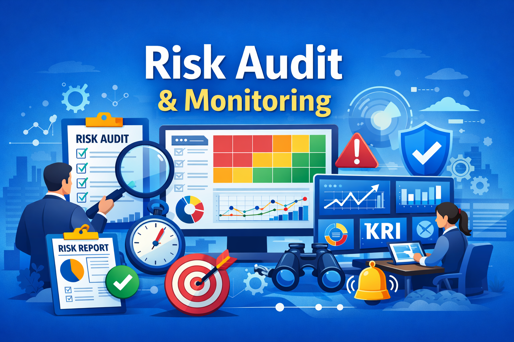

# **AUDIT & MONITORING RISIKO**

## 1. Pendahuluan

Dalam sistem manajemen risiko, proses **audit dan monitoring** berfungsi untuk memastikan bahwa semua kegiatan pengendalian risiko telah:
- Dijalankan sesuai kebijakan, prosedur, dan standar.
- Efektif dalam menurunkan tingkat risiko.
- Memberikan informasi bagi manajemen untuk perbaikan berkelanjutan.

**Monitoring** adalah kegiatan pemantauan risiko secara berkelanjutan.  
**Audit Risiko** adalah pemeriksaan formal dan sistematis terhadap efektivitas manajemen risiko.

---

## 2. Tujuan Audit & Monitoring Risiko

1. Memastikan risiko yang diidentifikasi dan ditangani sesuai dengan rencana.
    
2. Mengevaluasi efektivitas kontrol risiko yang telah diterapkan.
    
3. Mengidentifikasi kelemahan dalam proses manajemen risiko.
    
4. Memberikan rekomendasi perbaikan.
    
5. Menjamin kepatuhan terhadap regulasi dan standar (misalnya ISO 31000, ISO 9001, OHSAS 18001).
    

---

## 3. Monitoring Risiko

Monitoring dilakukan **secara terus-menerus** dengan fokus pada:

- **Key Risk Indicators (KRI):** indikator kuantitatif untuk mengukur perkembangan risiko.
    
- **Laporan Berkala:** status risiko dilaporkan ke manajemen secara bulanan/kuartalan.
    
- **Early Warning System:** sistem peringatan dini atas potensi risiko besar.
    
- **Update Risk Register:** memperbarui risiko baru atau perubahan level risiko.
    

### Metode Monitoring:

- **Observasi langsung** (contoh: inspeksi lapangan).
    
- **Analisis data** (contoh: laporan produksi, tingkat kecelakaan kerja).
    
- **Sistem IT RMS** (Risk Management System berbasis digital).
    

---

## 4. Audit Risiko

Audit risiko adalah pemeriksaan **independen dan sistematis** untuk menilai keefektifan sistem manajemen risiko.

### Jenis Audit Risiko:

1. **Internal Audit Risiko** → dilakukan oleh tim audit internal organisasi.
    
2. **External Audit Risiko** → dilakukan oleh pihak ketiga (auditor eksternal, regulator).
    

### Tahapan Audit Risiko:

1. **Perencanaan Audit**
    - Menentukan ruang lingkup (scope), tujuan, dan metode audit.
        
2. **Pengumpulan Data**
    - Wawancara, kuesioner, observasi, dan telaah dokumen (risk register, RTP).
        
3. **Evaluasi Efektivitas Kontrol**
    - Apakah mitigasi risiko berjalan sesuai rencana.
        
4. **Pelaporan Hasil Audit**
    - Menyusun laporan audit risiko yang berisi temuan, kelemahan, dan rekomendasi.
5. **Tindak Lanjut (Follow-up)**
    
    - Manajemen melakukan perbaikan berdasarkan rekomendasi auditor.
        

---

## 5. Alat & Dokumen Pendukung

- **Risk Register** → daftar risiko dan mitigasinya.
- **Risk Monitoring Report** → laporan status risiko.
- **Checklist Audit Risiko** → panduan pemeriksaan kontrol.
- **Heatmap Risiko** → visualisasi tingkat risiko.
- **Dashboard KRI** → pemantauan berbasis indikator.
    

---

## 6. Contoh: Rencana Audit Manajemen Risiko Keamanan Siber

Berikut adalah contoh draf **Rencana Audit (Audit Plan)** sederhana. Kita akan mengambil contoh kasus pada industri perbankan dengan fokus pada **Risiko Keamanan Siber (Cybersecurity)**, karena ini adalah risiko yang paling dinamis saat ini.

### Project Detail

- Unit Kerja yang Diaudit: Departemen IT & Operasional Digital
- Periode Audit: Kuartal I - 2026
- Tingkat Risiko: Tinggi (High)

### I. Tujuan Audit

1. Memastikan kebijakan keamanan data telah diimplementasikan sesuai standar (misal: ISO 27001).
2. Mengevaluasi efektivitas pengendalian teknis dalam mencegah akses tidak sah.
3. Memvalidasi bahwa rencana pemulihan bencana (_Disaster Recovery Plan_) berfungsi dengan baik.

### II. Ruang Lingkup Audit

- Infrastruktur jaringan dan server.
- Prosedur akses pengguna (Manajemen Password & MFA).
- Keamanan aplikasi _mobile banking_.
- Kepatuhan terhadap regulasi perlindungan data pribadi (UU PDP).

### III. Prosedur Audit (Langkah Kerja)

|**No**|**Aktivitas Audit**|**Teknik Audit**|
|---|---|---|
|1|**Tinjauan Kebijakan**|Memeriksa dokumen prosedur standar (SOP) keamanan informasi terbaru.|
|2|**Uji Penetrasi (_Pentest_)**|Melakukan simulasi serangan terbatas untuk melihat celah keamanan sistem.|
|3|**Verifikasi Akses**|Mengambil sampel data karyawan yang sudah _resign_ untuk memastikan akses mereka telah dicabut.|
|4|**Uji Coba Backup**|Memverifikasi hasil _backup_ data terakhir dan mencoba proses _restore_ data.|
|5|**Review Monitoring**|Memeriksa log aktivitas sistem untuk memastikan setiap anomali terdeteksi oleh tim monitoring.|

### IV. Alokasi Waktu & Sumber Daya

- **Durasi:** 10 Hari Kerja.
- **Tim:** 1 Lead Auditor, 2 Auditor IT Spesialis.

### Perbedaan Peran dalam Kasus Ini:

- **Tim Monitoring (Lini 1 & 2):** Setiap hari melihat layar _dashboard_ untuk memantau serangan masuk secara _real-time_. Jika ada serangan, mereka langsung bertindak.
- **Tim Audit (Lini 3):** Datang sebulan sekali atau setahun sekali untuk bertanya: _"Apakah tim monitoring sudah bekerja dengan benar? Apakah alat monitoring mereka sudah cukup canggih? Apakah ada serangan yang mereka lewatkan?"_

---

## 7. Tantangan Audit & Monitoring Risiko

- Data risiko tidak lengkap atau tidak valid.
    
- Resistensi dari unit kerja terhadap proses audit.
    
- Kurangnya sumber daya (auditor, waktu, biaya).
    
- Risiko baru yang muncul lebih cepat daripada proses review formal.

	
