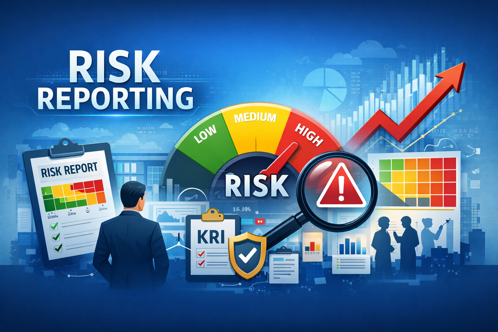
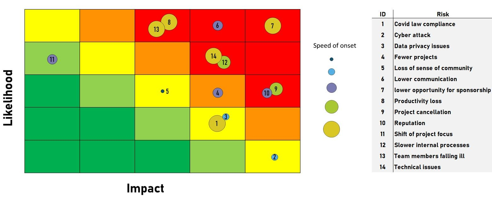
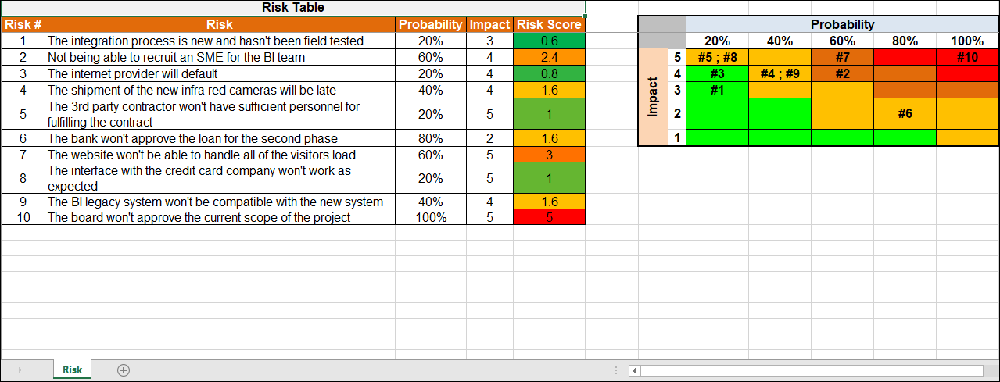

# RISK REPORTING

## 1. Pengertian Risk Reporting

**Risk Reporting** adalah proses **penyusunan, penyajian, dan penyampaian informasi risiko** kepada pihak-pihak terkait (manajemen, dewan direksi, regulator, dan pemangku kepentingan lainnya) secara **terstruktur, akurat, relevan, dan tepat waktu**, guna mendukung **pengambilan keputusan** dan **pengawasan risiko**.

Risk reporting menjawab pertanyaan kunci:
- Risiko apa yang sedang dihadapi organisasi?
- Seberapa besar tingkat risikonya?
- Bagaimana status pengendalian dan mitigasinya?
- Apakah risiko tersebut masih berada dalam batas risk appetite dan risk tolerance?

---

## 2. Tujuan Risk Reporting

Tujuan utama risk reporting meliputi:

1. **Mendukung pengambilan keputusan**  
    Memberikan dasar informasi yang jelas bagi manajemen untuk menentukan tindakan strategis, taktis, maupun operasional.
    
2. **Meningkatkan transparansi risiko**  
    Memastikan seluruh pihak terkait memahami eksposur risiko organisasi.
    
3. **Memantau efektivitas pengendalian risiko**  
    Menilai apakah risk treatment yang diterapkan sudah efektif atau perlu penyesuaian.
    
4. **Menjaga kesesuaian dengan risk appetite**  
    Mengidentifikasi risiko yang berada di luar batas toleransi yang telah ditetapkan.
    
5. **Memenuhi kebutuhan tata kelola dan kepatuhan**  
    Mendukung prinsip good corporate governance (GCG) serta kewajiban pelaporan kepada regulator.

---

## 3. Prinsip-Prinsip Risk Reporting yang Baik

Berikut beberapa prinsip penting yang perlu Anda perhatikan dalam menyusun *risk report*.

### a. Relevan dan Berorientasi pada Pengambilan Keputusan

Risk report harus **fokus pada informasi risiko yang material** dan berdampak langsung terhadap pencapaian tujuan organisasi, bukan sekedar memberikan informasi tanpa tujuan yang jelas.

**Implikasi praktis:**
- Menyajikan _key risks_ dan _top risks_, bukan seluruh daftar risiko operasional.
- Mengaitkan risiko dengan sasaran strategis, KPI, dan nilai organisasi.
- Menjelaskan implikasi risiko terhadap keputusan manajerial.

### b. Akurat, Andal, dan Dapat Dipertanggungjawabkan

Informasi yang dilaporkan harus **berdasarkan data yang valid, metode yang konsisten, dan asumsi yang jelas**.

**Implikasi praktis:**
- Menggunakan metodologi penilaian risiko yang terdokumentasi.
- Menyertakan sumber data, asumsi, dan batasan analisis.
- Memastikan adanya _review_ dan _quality assurance_ sebelum laporan disampaikan.

### c. Tepat Waktu (Timeliness)

Risk reporting harus disampaikan **pada waktu yang tepat**, sehingga masih relevan untuk tindakan korektif atau keputusan strategis.

**Implikasi praktis:**
- Frekuensi laporan disesuaikan dengan tingkat risiko (bulanan, triwulanan, ad-hoc).
- Risiko signifikan dan kejadian insiden dilaporkan segera (_exception reporting_).
- Menghindari laporan yang terlalu terlambat sehingga bersifat reaktif.

### d. Jelas, Ringkas, dan Mudah Dipahami

Laporan risiko harus **mudah dibaca dan dipahami oleh audiens non-teknis**, khususnya manajemen puncak dan dewan.

**Implikasi praktis:**
- Menggunakan visualisasi seperti _risk matrix_, _heat map_, dan grafik tren.
- Menghindari jargon teknis berlebihan tanpa penjelasan.
- Menyajikan ringkasan eksekutif (_executive summary_).

### e. Disesuaikan dengan Audiens (Audience-Driven)

Risk reporting yang baik bersifat **tailored**, menyesuaikan isi, detail, dan bahasa dengan kebutuhan penerima laporan.

**Contoh:**
- **Dewan Komisaris/Direksi**: fokus pada risiko strategis, risiko reputasi, dan risiko kepatuhan.
- **Manajemen operasional**: fokus pada risiko proses, kontrol, dan rencana mitigasi.
- **Regulator**: fokus pada kepatuhan dan transparansi.

### f. Konsisten dan Terstandarisasi

Laporan risiko harus **konsisten antar periode dan antar unit**, sehingga memudahkan analisis tren dan perbandingan.

**Implikasi praktis:**
- Menggunakan skala risiko dan kriteria evaluasi yang sama.
- Format laporan yang baku.
- Definisi risiko, likelihood, dan impact yang seragam.

---

### g. Transparan dan Seimbang

Risk reporting yang baik **tidak hanya menampilkan risiko negatif**, tetapi juga keterbatasan kontrol dan ketidakpastian yang ada.

**Implikasi praktis:**
- Mengungkapkan risiko residual secara jujur.
- Menyampaikan area kelemahan kontrol.
- Tidak “menyembunyikan” risiko demi citra organisasi.

### h. Berorientasi pada Tindakan (Action-Oriented)

Laporan risiko harus **mengarah pada keputusan dan tindak lanjut**, bukan sekadar dokumentasi.

**Implikasi praktis:**
- Menyertakan status mitigasi dan _risk treatment plan_.
- Menjelaskan siapa _risk owner_ dan target waktu penyelesaian.
- Mengaitkan risiko dengan rekomendasi tindakan.

---

### i. Terintegrasi dengan Sistem Manajemen Organisasi

Risk reporting yang baik terintegrasi dengan **perencanaan strategis, penganggaran, pengendalian internal, dan kinerja**.

**Implikasi praktis:**
- Sinkron dengan sistem KPI dan performance management.
- Mendukung proses _risk-based decision making_.
- Menjadi bagian dari siklus tata kelola perusahaan (_governance cycle_).

---

### j. Mendukung Budaya Risiko (Risk Culture)

Risk reporting harus mendorong **keterbukaan, kesadaran risiko, dan akuntabilitas** di seluruh organisasi.

**Implikasi praktis:**
- Mendorong pelaporan risiko tanpa budaya saling menyalahkan.
- Menunjukkan komitmen manajemen terhadap pengelolaan risiko.
- Menjadi sarana komunikasi risiko, bukan alat kontrol semata.

---

## 4. Pihak-Pihak yang Terlibat dalam Risk Reporting

* **Penyusun Laporan**
	- Risk Management Unit / Enterprise Risk Management (ERM)
	- Risk Owner di masing-masing unit kerja
* **Penerima Laporan**
	- Manajemen operasional
	- Manajemen puncak (Direksi)
	- Dewan Komisaris / Komite Risiko
	- Regulator (jika diwajibkan)
	- Auditor internal dan eksternal

---

## 5. Jenis-Jenis Risk Reporting

#### Berdasarkan Tingkat Organisasi

1. **Operational Risk Report**  
    Fokus pada risiko operasional harian.
    
2. **Tactical / Managerial Risk Report**  
    Digunakan oleh manajemen menengah untuk pengendalian dan koordinasi.
    
3. **Strategic Risk Report**  
    Ditujukan kepada direksi dan dewan, berisi risiko strategis dan risiko utama (key risks).

#### Berdasarkan Waktu
- **Periodic reporting** (bulanan, triwulanan, tahunan)
- **Ad-hoc reporting** (jika terjadi insiden besar atau perubahan signifikan)

---

## 6. Isi Utama Risk Report

Risk report umumnya memuat elemen berikut:

1. **Ringkasan Eksekutif (Executive Summary)**
    - Profil risiko utama
    - Perubahan signifikan dibanding periode sebelumnya
        
2. **Risk Register Ringkas**
    - Daftar risiko utama
    - Risk owner
    - Kategori risiko
        
3. **Penilaian Risiko**
    - Likelihood
    - Impact
    - Level risiko (inherent dan residual)
        
4. **Status Pengendalian dan Mitigasi**
    - Risk treatment yang telah dan sedang dilakukan
    - Tingkat efektivitas kontrol
        
5. **Risk Heat Map**
    - Visualisasi posisi risiko terhadap risk appetite
    - Contoh penyajian laporan dalam bentuk *heat map*.

**contoh 1:**

**contoh 2:**

6. **Key Risk Indicators (KRI)**
    - Indikator peringatan dini
    - Status threshold (normal, warning, critical)
        
7. **Isu Risiko Kritis dan Eskalasi**
    - Risiko yang melewati risk tolerance
    - Rencana tindak lanjut dan keputusan yang dibutuhkan

---

## 7. Format dan Media Risk Reporting

Risk reporting dapat disajikan dalam berbagai bentuk, antara lain:

- **Laporan tertulis** (PDF, dokumen formal)
- **Dashboard risiko** (berbasis aplikasi atau BI tools)
- **Presentasi manajemen**
- **Laporan kepatuhan regulator**

Pemilihan format disesuaikan dengan tingkat manajemen dan kebutuhan pengguna.

Berikut beberapa contoh template yang bisa digunakan untuk risk reporting:
1. [csra_sample_riskreport](../arsip/csra_sample_riskreport.doc)
2. [risk-management-report-openregulatory](../arsip/risk-management-report-openregulatory.docx)
3. [risk_report_template_cambridge_-_august_2022](../arsip/risk_report_template_cambridge_-_august_2022.docx)

---

## 8. Tantangan dalam Risk Reporting

Beberapa tantangan umum meliputi:
- Data risiko tidak konsisten antar unit
- Terlalu banyak informasi (information overload)
- Laporan bersifat administratif, bukan analitis
- Kurangnya integrasi dengan pengambilan keputusan

---

## 9. Contoh Risk Reporting

Berikut beberapa contoh nyata laporan pelaksanaan *risk assesment*
1. [Laporan Manajeme Risiko - Pengadilan Tinggi Agama Jakarta 2023](../ebook/laporan-manajemen-risiko-pta-jakarta.pdf) ([sumber](https://www.pta-jakarta.go.id/filepdf/risk-register/LAPORAN%20MANAJEMEN%20RISIKO%20PTA%20JAKARTA.pdf))    
2. [laporan-pelaksanaan-penilaian-risiko-bp2d-jabar-2024](../ebook/laporan-pelaksanaan-penilaian-risiko-bp2d-jabar-2024.pdf) ([sumber](https://bp2d.jabarprov.go.id/assets/document/other/laporan-pelaksanaan-penilaian-risiko-bp2d-jabar-2024.pdf))
3. [WIKA IR - Manajemen Risiko - Annual Report 2023](https://investor.wika.co.id/misc/AR/flipbook/AR2023/660/)
4. [Laporan Manajemen Risiko PT TIMAT 2021](../ebook/laporan-manajemen-risiko-pt-timah-2021.pdf)

---

## 💼 Diskusi & Tugas

### PT TIMAH 2021
Pelajari [Laporan Manajemen Risiko PT TIMAT 2021](../ebook/laporan-manajemen-risiko-pt-timah-2021.pdf), diskusikan beberapa poin berikut:

1. Ada berapa orang yang secara khusus bertanggungjawab dalam pengelolaan risiko?
2. Apa upaya yang dilakukan untuk mempersiapkan personil pengelola risiko?
3. Apa yang menjadi acuan menetapkan jenis resiko?
4. Apa yang Anda bisa ceritakan dengan data yang ditampilkan ada grafik _Efektifitas Pengendalian Risiko PT TIMAH Tbk_?
5. Jika melihat _Pengukuran Maturitas Manajemen Risiko_, apakah implementasi manajemen risiko di PT TIMAH membaik atau sebaliknya?
6. Apa saja perkara hukum dan sanksi administratif yang diterima pada tahun 2021?

### PTAJ 2024
Pelajari [Laporan Manajeme Risiko - Pengadilan Tinggi Agama Jakarta 2023](../ebook/laporan-manajemen-risiko-pta-jakarta.pdf) ([sumber](https://www.pta-jakarta.go.id/filepdf/risk-register/LAPORAN%20MANAJEMEN%20RISIKO%20PTA%20JAKARTA.pdf))    
1. Apa hubungan antara *Lampiran Form 1, Form 2 dan Form 3*.
